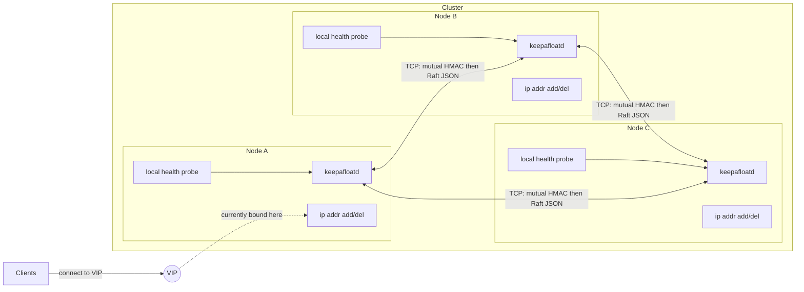
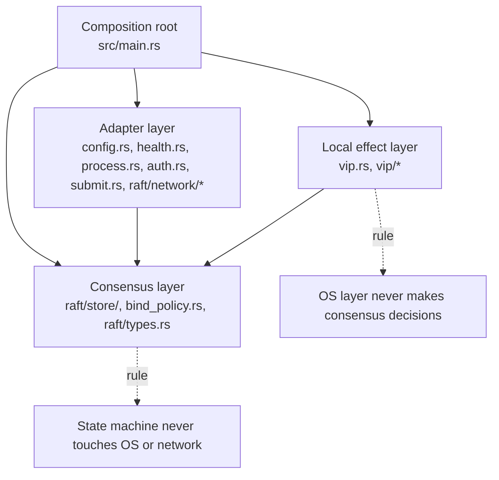
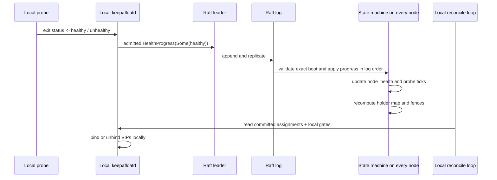
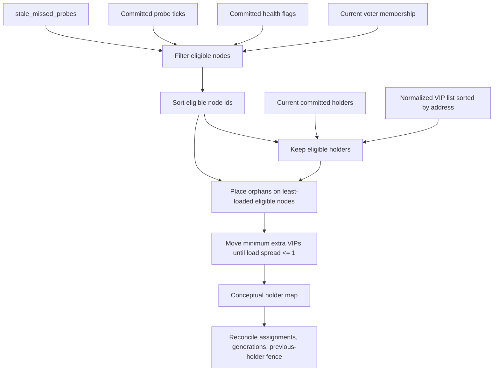
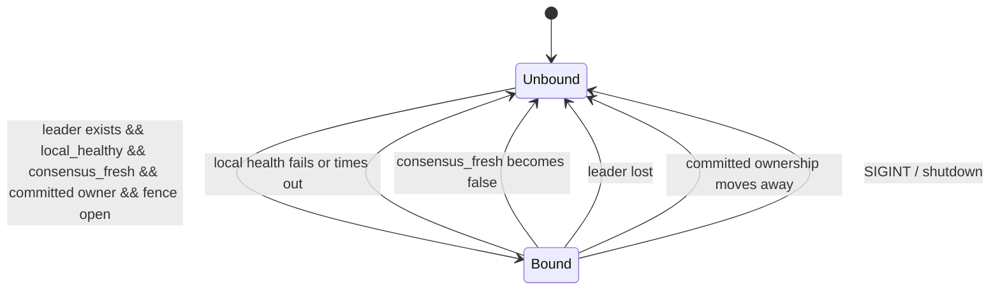
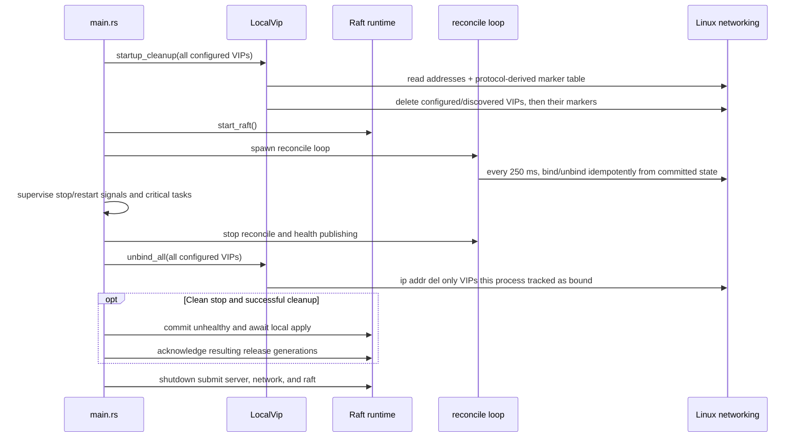
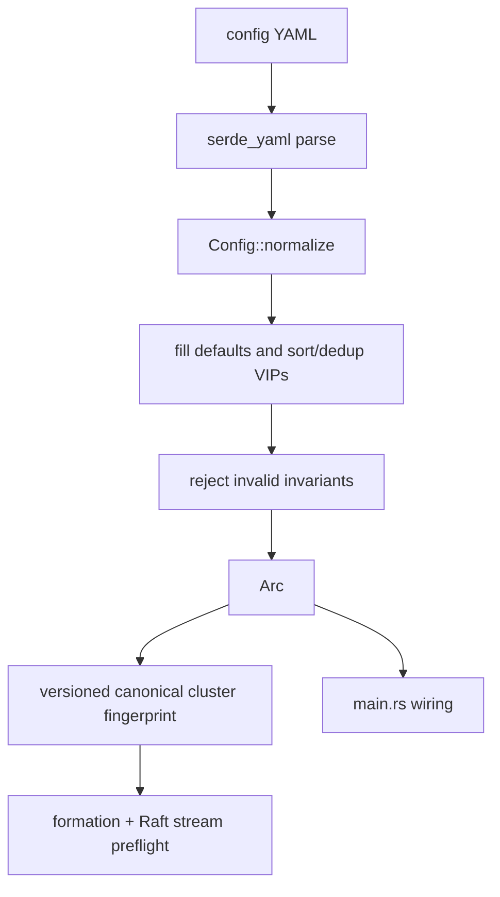
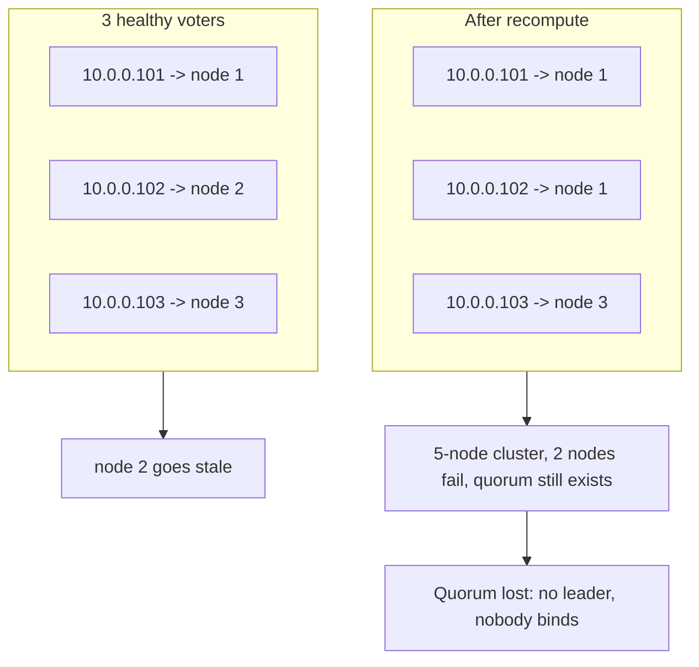
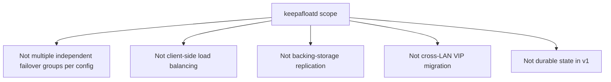

# keepAfloatD Architecture

This is the canonical architecture reference for `keepafloatd`; keep `AGENTS.md` short and point deeper design questions here.

The Raft log carries exact-boot admission operations, challenged health
progress and generation-fenced VIP releases. Peer health staleness uses
committed probe ticks, not wall-clock timestamps. Process-local runtime
permission has a separate expiry and is never restored from a snapshot.

## 1. System overview

`keepafloatd` is a small cluster-local control plane that elects which node should bind each VIP and then applies that decision through Linux networking commands on exactly one eligible owner at a time.



Each node runs one daemon process with one YAML config, one Raft identity, one health-check
definition, and one shared VIP set. The cluster may manage one VIP or multiple VIPs, but all of them
belong to the same failover group. Cold-start placement is round-robin across healthy voters;
subsequent changes minimize movement while keeping the spread even. Clients never talk to Raft
directly; they only see the VIP that is currently attached to one node's interface.

## 2. Layered architecture

The code is split into four layers so that consensus decisions stay deterministic while OS effects stay local and reversible.



- Consensus layer:
  - `src/raft/store/` separates the volatile log (`log.rs`), shared state
    (`state.rs`), apply/snapshot logic (`state_machine.rs`) and pure
    eligibility/assignment rules (`vip_logic.rs`), wired by `mod.rs`.
  - `src/bind_policy.rs` mirrors the pure "should this node bind?" decision from committed state plus local gates.
- Local effect layer:
  - `src/vip.rs` coordinates local lifecycle; `src/vip/effects.rs` owns bounded `ip` command
    construction and verification; `src/vip/ownership.rs` owns Linux address-protocol discovery;
    `src/vip/announce.rs` owns background ARP/NA announcements;
    `src/vip/notify.rs` owns bounded notify hooks; and `src/vip/reconcile.rs` maps committed
    ownership into those local effects and publishes confirmed release acknowledgments.
  - It tracks which VIPs this process has actually bound so cleanup is safe.
- Adapter layer:
  - `src/config.rs` loads and normalizes YAML; `src/config/fingerprint.rs` derives the canonical
    non-secret cluster identity.
  - `src/health.rs` runs the subprocess health check.
  - `src/process.rs` owns bounded Linux process groups for all daemon-owned child commands.
  - `src/auth.rs` owns the shared fixed-format mutual HMAC handshake for both TCP listeners.
  - `src/submit.rs` forwards follower-originated writes to the leader.
  - `src/raft/tasks.rs` catches, reports, aborts, and joins Raft background control tasks.
  - `src/raft/network.rs` owns peer connection lifecycle, outbound preflight, and RPC exchange.
  - `src/raft/network/client.rs` adapts RPC exchange to OpenRaft's outbound client traits and
    negotiates real Pre-Vote requests on fresh peer connections.
  - `src/raft/network/server.rs` owns listener admission, authentication, and stream supervision.
  - `src/raft/network/inbound.rs` owns authenticated, preflight-gated inbound RPC dispatch.
  - `src/raft/network/wire.rs` owns bounded framing, calls the shared authentication handshake,
    and checks compatibility.
  - `src/raft/network/status.rs` owns capability and cluster-status probes over fresh mutually
    authenticated connections, with no legacy authentication fallback.
- Composition root:
  - `src/main.rs` wires config, Raft, health publishing, submit listener, reconcile loop, and shutdown ordering.

The most important boundary is non-negotiable: the state machine never reads the network or the OS, and the OS layer never decides ownership on its own. If a proposed feature blurs that line, it is usually the wrong feature for this project.

## 3. Replicated state model

The Raft log carries small deterministic facts, while the state machine derives VIP ownership and handoff fences from those facts in exactly the same order on every node.



What the current code replicates through Raft:

- Direct keepafloatd requests:
  - `AdmissionGenesis`, `PrepareJoin`, `LearnerApplied`, `CancelJoin`
  - `HealthProgress` with exact boot, challenge and optional health
  - `VipReleased { node_id, vip, generation }`
  - Compatibility readers retain `HealthUpdate`, `ClusterFormed`,
    `EnableFailoverSemanticsV2` and `EnableConfigIdentityV1`; production
    health publication uses admitted progress, not a physical-ID fallback.
- OpenRaft membership entries:
  - learner attachment, catch-up and voter replacement are committed
    through OpenRaft membership entries, not a public roster-change API

What lives in the replicated state machine or snapshot:

- `node_health: HashMap<NodeId, bool>`
- `node_probe_ticks: HashMap<NodeId, u64>`
- `latest_probe_tick: u64`
- `vip_assignments: HashMap<IpAddr, VipAssignment>`
- `vip_generation: HashMap<IpAddr, u64>`
- `vip_last_holder: HashMap<IpAddr, u64>` retains the release fence
  across intervals with no eligible owner
- `cluster_epoch: Option<u128>`
- `failover_semantics: Legacy | V2`
- `config_identity_enforced: bool`
- recovery/nopreempt tracking used by the selected semantics
- `last_membership`
- admission genesis, pending learner operations and completed JOIN receipts

What is derived locally but not replicated:

- `local_healthy`: the latest result from this process's own probe task
- `consensus_fresh`: whether this node can still submit health or release updates through Raft
- `has_leader`: observed from local Raft metrics
- `LocalVip.bound`: the set of VIPs this process itself attached
- the local boot identity, admission certificate, expiry and issuer reservations

Determinism rules in the current implementation:

- No wall-clock timestamps enter the replicated decision path.
- No RNG enters the state machine.
- Eligibility uses committed probe ticks, not local clocks.
- Nodes are sorted by id before placement and tie-breaking.
- VIPs are sorted by address during config normalization and then reused in that order.
- Lookup maps may be `HashMap`, but the inputs that drive recomputation are explicitly ordered before assignment.

`VipReleased` exists because ownership changes are fenced: a new holder may need to wait for the
old holder to confirm it has already unbound the VIP, or to wait until the old holder's committed
probes become stale. A fresh `healthy: false` report proves the old process is still participating
and therefore cannot substitute for its release acknowledgement. The old holder submits this
acknowledgement only after its kernel unbind succeeds or an exact-host query verifies that the
address is already absent.

## 4. VIP assignment algorithm

`recompute_vip_holder` turns membership plus committed health freshness into a deterministic,
minimal-movement owner map, then `reconcile_vip_assignments` adds handoff generations and
previous-holder fences.



Plain-language algorithm:

1. Start from the committed voter membership.
2. Keep only nodes whose committed `healthy` flag is `true`.
3. Drop any node whose committed probe tick lags the cluster's `latest_probe_tick` by more than `stale_missed_probes`.
4. Sort the surviving node ids ascending.
5. Keep every VIP whose current committed holder remains eligible.
6. Place orphaned VIPs, in address order, on the least-loaded eligible node (lowest id breaks ties).
7. If the load difference is greater than one, move only the needed donor VIPs; each donor's
   highest-address VIP moves, with node ties resolved deterministically by id. With no current
   holders, this reduces to round-robin.
8. Under V2 nopreempt, recovered nodes may receive orphans but are excluded as recipients of these
   proactive balancing moves.
9. If there are no eligible nodes, produce no owners at all.
10. Reconcile the raw owner map into `VipAssignment` values:
   - unchanged holder -> keep generation
   - changed holder -> bump generation, remember previous holder, and set a release/activation fence
   - assignment after an ownerless interval -> bump the retained generation and restore the
     activation holdoff; only a VIP with no generation history activates immediately
11. At the local effect boundary, the first bind must cross that fence. Once this process has safely
    bound the still-assigned VIP, a generation-scoped local activation proof prevents recovery of
    the recorded previous holder from revoking it. The proof is cleared on any unbind path and
    never carries into another generation; all leader, health, consensus-freshness, holder, and
    activation-tick gates still apply. If the previous holder releases after that first bind, the
    incumbent emits one more generation-scoped ARP/NA announcement so removal of a crash orphan cannot
    leave neighbors using the old holder's MAC.

Worked example, 3 nodes and 3 VIPs (all three eligible before the first assignment; a staggered
start recomputes on every committed health report and converges on an equally balanced mapping
that depends on join order, derived identically on every replica):

- Healthy eligible nodes: `[1, 2, 3]`
- Sorted VIPs: `[10.0.0.101, 10.0.0.102, 10.0.0.103]`
- Result:
  - `10.0.0.101 -> 1`
  - `10.0.0.102 -> 2`
  - `10.0.0.103 -> 3`

After node `2` goes stale:

- Healthy eligible nodes: `[1, 3]`
- Same sorted VIPs
- Result:
  - `10.0.0.101 -> 1`
  - `10.0.0.102 -> 1`
  - `10.0.0.103 -> 3`

That redistribution happens on every node after it has applied the same committed prefix, so the cluster converges without any out-of-band coordinator.

## 5. Failover triggers

A VIP stays bound on this node only while local gates, committed ownership, and leadership visibility all remain true at the same time.



The failover paths are:

- Local health fails:
  - after continuous failure for `failover_delay_secs`, the health task flips `local_healthy` to
    `false` (default zero; a successful probe resets the delay)
  - the next 250 ms reconcile tick removes any VIP currently bound here
- A bind or ownership-marker write fails:
  - the local health gate faults immediately, bypassing probe-failure delay
  - successful service probes cannot reset this sticky fault; repair the
    cause and restart the process
- This node stops being allowed to hold the VIP:
  - no current leader, or
  - committed ownership moves to another node, or
  - the replacement fence is not yet open
- A holder dies silently:
  - its committed probe tick stops advancing
  - once the lag exceeds `stale_missed_probes`, it becomes ineligible
  - recomputation reassigns the VIP everywhere
- A holder reports explicit failure but keeps publishing fresh probes:
  - recomputation may assign a replacement, but the replacement remains fenced
  - only the old holder's committed `VipReleased` opens the fence
  - a failed or unreadable kernel delete cannot be mistaken for a crash

There is also a local self-fencing path for partitions: if this node cannot commit health or release updates anymore, `consensus_fresh` flips false and the VIP is unbound even before the rest of the cluster necessarily marks it stale.

### Election stability with Pre-Vote

`src/raft/mod.rs` enables OpenRaft Pre-Vote with `enable_pre_vote: Some(true)`.
Before starting an ordinary election, a node asks whether a majority would
grant its prospective vote. The receiver handles this through
`Raft::pre_vote`, not `Raft::vote`: the request does not save a vote,
advance the receiver's term, append log entries, or change VIP ownership.
The transport and protocol version boundary are described in section 7.

An isolated follower cannot collect that majority and repeatedly attempts
Pre-Vote without inflating its saved term. When it reconnects to an
upgraded, healthy majority, those unsuccessful attempts do not force the
current leader to step down. This protects majority leadership, not the
isolated follower's VIPs: failed health submissions or expiry of its local
consensus proof still cause withdrawal, and the majority still reassigns
stale holders under the existing ownership fences.

A process suspended with SIGSTOP cannot remove its kernel addresses while
stopped. After SIGCONT it must process the expired consensus proof and
clean up before safely resuming VIP service. Pre-Vote does not provide
external fencing of a suspended process or a zero-overlap guarantee
during suspension.

Actual leader loss still requires an election. A reachable majority can
pass Pre-Vote and elect a replacement once the old leader is no longer
fresh. The `has_leader`, `local_healthy`, `consensus_fresh`, applied-state,
and ownership-fence gates remain unchanged; Pre-Vote never authorizes a
VIP to remain bound through a failed gate. It also does not restore votes
or history forgotten on a diskless restart, or replace the cluster
incarnation fence.

## 6. Crash and stop safety

Crash and stop safety are built into the lifecycle: reclaim on startup, idempotent reconcile in steady state, and explicit unbind-before-shutdown on stop.



Startup:

- Before `ip addr replace`, every bind writes a `throw` host route to dedicated policy table
  `10000 + address_protocol` with that protocol. The route is OS-held ownership evidence and
  survives process death. The protocol defaults to 246 and is node-local, not replicated or
  included in configuration identity. Operators must reserve the derived table from other routes
  and `ip rule` entries.
- An ambiguous marker-command result retains both graceful-cleanup tracking and first-bind state.
  A retry therefore still announces a newly attached address, while shutdown attempts exact
  address and marker deletion even if the original command reached the kernel before timing out.
- `LocalVip::startup_cleanup` obtains bounded JSON address and IPv4/IPv6 marker-route inventories.
  It matches this instance's exact route protocol to the sole interface carrying that IP, merges
  those addresses with the current configured VIPs, deletes the addresses, then deletes the marker
  routes before joining Raft. A marker left by interruption before address attachment is also
  removed. Current configured VIPs do not need a marker, preserving rolling-upgrade cleanup.
- Malformed or unreadable discovery data aborts startup. A marker must be an exact IPv4 `/32` or
  IPv6 `/128` `throw` route; an address found on multiple interfaces is ambiguous and fails closed.
- A failed delete is accepted only after an exact-host `ip addr show` proves absence. Spawn, probe,
  or still-present failures abort startup, so the node cannot acknowledge release while an orphan
  remains attached.
- The reconcile loop keeps all VIP effects and release acknowledgments disarmed until local
  `last_applied` reaches OpenRaft's leader-reported `cluster_committed` frontier. This prevents a
  wiped restart from binding while it has applied only an obsolete prefix of the replicated state.

Steady state:

- `run_reconcile_loop` ticks every 250 ms.
- Each tick is idempotent: the loop recomputes "should bind?" from:
  - `has_leader`
  - `local_healthy`
  - `consensus_fresh`
  - committed `VipAssignment`
  - previous-holder release / staleness fence
- A nonzero steady-state delete is successful only if an exact-host query proves the address is
  already absent. Query failure or a still-present address keeps the VIP tracked and the release
  fence closed.

Shutdown:

- `main.rs` stops reconciliation and health publishing before cleanup,
  preventing rebinds or new healthy reports during handoff.
- The submit listener is a critical task. Bind failure, unexpected completion, or task failure
  stops the composition root; shutdown joins the service tasks and returns lifecycle errors.
- Accepted submit clients, the Raft accept/reconnect/inbound task tree,
  runtime admission and stale-survivor control loops are owned and supervised. Unexpected completion,
  error, or panic stops the daemon; cancellation aborts and joins the children before listener and
  runtime shutdown.
- `unbind_all` runs before submit/network/Raft shutdown.
- On a clean stop with successful cleanup, `src/handoff.rs` commits an
  unhealthy report, waits for local application and acknowledges the
  resulting release generations within one `submit_timeout_ms` budget.
  Missing quorum or proof leaves peers on the stale-holder fallback.
  Failed cleanup or a fatal task error never publishes shutdown releases.
- `SIGINT` / `SIGTERM` request a clean stop. `SIGHUP` / `SIGQUIT` use the
  cleanup path and exit with status 1 for `Restart=on-failure`; configs
  are read by the new process, not reloaded in place.
- `unbind_all` bounds each delete to 250 ms, retries it at most three times, attempts every tracked
  VIP, and returns an error if any cleanup remains exhausted. The sample systemd unit's
  `KillMode=mixed` keeps its graceful SIGTERM away from teardown-time children while retaining a
  cgroup-wide SIGKILL at `TimeoutStopSec`.
- Health probes, notify hooks, `ip`, `arping` and `ndptool` share one bounded Linux process-group runner. The
  guard sends SIGKILL to the group on normal completion, timeout, or future cancellation, and the
  direct child is reaped within a fixed bound. This prevents shell descendants and inherited output
  pipes from escaping shutdown.
- `LocalVip.bound` ensures this process only deletes VIPs it believes it attached itself.

This design makes crash recovery symmetrical: if the process dies without a graceful stop, the
next process start reclaims both configured VIPs and its marked crash orphans before participating
again. `address_protocol` is a network-namespace contract: operators must assign distinct values
to co-located keepafloatd instances, reserve each `10000 + value` table, and keep the value stable
across restarts. Rotate only after a graceful stop proves the old marker is absent; after a crash,
restart once with the old value or clean its addresses manually. The diskless daemon cannot infer
which other marker was formerly its own without risking another instance's addresses. During an
upgrade from an unmarked release, restart every node while soon-to-be-removed
VIPs remain configured, verify the live addresses have routes in the expected derived table, and
only then remove those VIPs.
Addresses already orphaned and removed before that transition cannot be attributed safely and
require manual cleanup.

## 7. Transport and auth

keepAfloatD uses two TCP listeners: one for Raft RPC and status, and one for
follower-to-leader submit forwarding. Both require the same fixed binary mutual
HMAC-SHA256 handshake before length-prefixed JSON. The shared key is never sent.
JSON remains plaintext. Admission records have a connection- and
challenge-bound MAC; ordinary Raft and status records still require a
trusted network or an authenticated encrypted tunnel.

`src/connection_admission.rs` supplies the shared two-stage semaphore gate used by both listeners:
one permit bounds work before authentication and a separate permit bounds accepted work afterward.

The submit listener forwards admitted release acknowledgements. Health
progress uses the admission-management channel instead. The following
sequence shows release forwarding to a remote leader:

```mermaid
sequenceDiagram
  participant Follower as Follower node
  participant Submit as submit.rs
  participant LeaderSubmit as Leader submit listener
  participant LeaderRaft as Leader raft.client_write
  participant PeerNet as raft/network.rs
  participant Followers as Other raft followers

  Follower->>Submit: submit VipReleased with current admission
  Submit->>LeaderSubmit: C: initiator hello with fresh nonce
  LeaderSubmit-->>Submit: S: responder hello with fresh nonce, proof(2)
  Submit->>Submit: verify proof(2) over C and S
  Submit->>LeaderSubmit: proof(1)
  LeaderSubmit->>LeaderSubmit: verify proof(1) over C and S
  LeaderSubmit-->>Submit: proof(3)
  Submit->>Submit: verify proof(3) before sending JSON
  Submit->>LeaderSubmit: signed ReleaseEnvelope(genesis, request)
  LeaderSubmit->>LeaderSubmit: verify record MAC, exact boots, genesis and admission
  LeaderSubmit->>LeaderRaft: raft.client_write(req)
  LeaderRaft->>PeerNet: append and replicate
  Note over PeerNet,Followers: New Raft connection: mutual HMAC, then preflight unless cached
  PeerNet->>Followers: Raft RPC over framed JSON
  Followers-->>LeaderRaft: responses / acks
  LeaderSubmit-->>Submit: signed SubmitResponse with committed log ID
  Submit->>Submit: verify response MAC and current authority
  Note over Submit,Followers: JSON is plaintext; release records have a connection-bound MAC
  Note over PeerNet,Followers: Ordinary Raft and status records have no record MAC
```

Raft peer transport (`src/raft/network.rs` and `src/raft/network/*`):

- module boundaries:
  - `network.rs`: peer links, reconnects, outbound preflight, and RPC exchange
  - `network/client.rs`: OpenRaft outbound client traits, Pre-Vote negotiation and envelopes,
    and whole-snapshot envelopes
  - `network/server.rs`: listener admission, authentication, and inbound task supervision
  - `network/inbound.rs`: authenticated inbound dispatch and preflight enforcement
  - `network/request.rs`: typed operation envelopes and matching response-tag checks
  - `network/wire.rs`: bounded frames, shared HMAC handshake calls, incarnation flags, config
    preflight, and V2 compatibility checks
  - `network/status.rs`: status responses and short-lived capability probes after mutual
    authentication; the status JSON itself has no MAC

- handshake:
  - the shared protocol described below uses listener discriminator `1` for Raft and status
  - each hello binds its sender and intended recipient IDs, fresh nonce, capability flags and
    optional cluster incarnation; the responder ID must match the configured destination
  - Raft connections advertise their current incarnation when known and their current V2
    semantics flag; status discovery may omit the incarnation and uses a clear V2 hello bit
    so discovery remains separate from Raft-dispatch compatibility checks
  - every connection, including reconnects and short-lived status probes, uses fresh nonces
- first framed exchange on a new outbound stream:
  - `ClusterStatusRequest` advertises the sender's optional versioned config fingerprint and
    cancellation-safe reader capability
  - `ClusterStatusResponse` advertises the receiver's fingerprint, capabilities including
    `supports_pre_vote`, and replicated enforcement flag
  - a concrete mismatch closes the stream before any Raft frame is dispatched
  - the connect + handshake + preflight operation has a five-second outer bound
  - before identity activation, a peer previously preflighted with a missing config identity
    may reconnect using that cached result, but still completes a fresh mutual handshake;
    this retained compatibility path avoids a status-RPC dependency during quorum recovery
  - identity activation drops those missing-identity streams, and every following reconnect
    must complete the fingerprint preflight; neither path accepts the old authentication format
- framed RPC payloads:
  - 4-byte BE frame length
  - JSON object with exactly one operation key: `status`, `pre_vote`,
    `append_entries`, `install_snapshot`, `vote`, `admission`, or
    `admission_control`
  - requests and responses use the same key; a mismatched reply closes
    the stream even if its inner payload has a compatible shape
  - unknown, duplicate or multiple operation keys, unwrapped messages
    and malformed selected payloads fail without alternate decoding
  - payloads decode directly into concrete types, preserving full-width
    integers such as 128-bit cluster epochs
  - tags identify operations but do not authenticate or encrypt records;
    admission and management payloads carry separate connection- and
    challenge-bound MACs
- concurrency model:
  - each outbound peer link is `Mutex<Option<TcpStream>>`
  - a slow peer does not block every other peer
  - the listener admits at most 32 unauthenticated and 64 authenticated connection tasks
  - each configured peer contributes eight slots independently to each
    phase; peers sharing a canonical source IP combine their quotas
  - entering the authenticated pool releases the pre-authentication
    slot; saturation of either pool rejects new work without queuing
  - authenticated inbound frame bodies share a 128 MiB pre-allocation byte budget
  - unknown source IPs are rejected before task admission; after the handshake, the claimed peer
    id must match the source IP advertised for that peer
  - outbound sockets bind to this node's advertised Raft IP so source checks remain valid on
    multi-homed hosts; peers sharing one IP rely on the cluster secret rather than IP identity
  - configuration rejects mixed IPv4/IPv6 endpoint families within either protocol roster because
    an advertised source address cannot be bound across address families
- failure handling:
  - any I/O or timeout failure drops only that peer stream
  - the complete mutual handshake has one five-second deadline, including partial reads and
    writes; response writes retain their separate five-second deadline
  - idle authenticated streams expire after the greater of five seconds and twice the heartbeat
    interval; once the first byte arrives, one five-second deadline covers the rest of the prefix
    and body, so trickled bytes never restart the budget
  - state acquisition, identity/semantics checks, and RPC dispatch share a five-second processing
    deadline; timeout drops the stream and returns its connection and frame-byte permits
  - cancellation while a request/response exchange is in flight also drops that stream; otherwise
    its unread response could be consumed by the next Raft RPC
  - inbound response writers require one nonblocking TCP write to accept the complete length prefix
    and payload; a short write closes the stream instead of resuming the body after an await
  - current readers advertise cancellation-safe stream ownership in status JSON and may reuse
    a connection; inbound response timing still uses that JSON assertion independently from
    the authenticated hello flags
  - the retained cancellation-unsafe response path reuses a stream only when state acquisition,
    dispatch, and the single nonblocking write complete inside 80% of one heartbeat interval
  - a later response on that path is dropped before close, so a reader's competing timeout cannot
    retain either a partial frame or a complete late response for the next RPC; this is not
    legacy authentication support
  - background reconnect loops retry on short fixed intervals
  - RPC calls honor OpenRaft `hard_ttl` with a minimum timeout floor
  - diskless catch-up caps each unary AppendEntries payload at 32 log entries, preventing an
    expensive replay batch from repeatedly exceeding the heartbeat-derived RPC deadline

Pre-Vote exchange (`src/raft/network/client.rs`, `src/raft/network/inbound.rs`):

- Each attempt opens a fresh connection to a configured peer, binds to
  the local advertised Raft address, sends the existing shared-secret
  handshake, and completes the status preflight on that same connection.
  It neither reuses the replication stream nor trusts a cached capability
  or the ordinary reconnect path's legacy preflight shortcut.
- Protocol version 3 requires `supports_pre_vote: true`. The client
  sends `{"pre_vote": <VoteRequest>}` and accepts only the matching
  `{"pre_vote": <VoteResponse>}` envelope, returning the peer's actual
  response, including a denial, to OpenRaft.
- Missing or false Pre-Vote support is an error, never a synthetic
  grant. Unknown targets, failed authentication, timeouts, disconnects,
  malformed or mismatched responses, and rejected preflights also fail.
  There is no legacy Pre-Vote fallback or mixed-version operation.
- Before checking capability support, the client rechecks current
  incarnation, failover-semantics activation, and configuration-identity
  policy against the completed preflight. Inbound Pre-Vote passes the
  same source/peer identity, secret, semantics, configuration, and
  incarnation gates as other non-status Raft RPCs before dispatch.
  Status remains available for discovery of incompatible peers, but its
  response does not bypass those RPC fences. Missing incarnations retain
  the existing blank-node compatibility rule; concrete mismatches fail.
- Dispatch decodes the operation envelope once. A `pre_vote` request
  calls `Raft::pre_vote` only; malformed or hybrid operation envelopes
  cannot fall through to the mutating ordinary-vote handler.
- One timeout covers connection setup, negotiation, and the exchange:
  OpenRaft's `hard_ttl`, with the existing 50 ms minimum. Preflight also
  retains its five-second outer bound and 64 KiB status-response cap;
  Pre-Vote frames use `max_frame_bytes`. The fresh stream is dropped on
  completion, error, or cancellation, so no unread response can leak into
  a subsequent replication RPC.

Follower-to-leader submit transport (`src/submit.rs`):

- mutual authentication with listener discriminator `2`, then one signed
  release request/response over `client_submit_listen`; the exact process
  boots and current genesis fence the operation
- fixed 4 KiB request/response frame cap, independent of the Raft snapshot cap
- at most 32 unauthenticated and 64 authenticated connection tasks; excess sockets and unknown
  source IPs are dropped before a request-sized allocation
- eight connections per configured peer in each phase independently;
  shared source IPs combine their quotas, and authentication releases
  the handshake slot when the authenticated pool admits the request
- outbound forwarding binds to the local advertised submit IP; same-IP peers share the secret's
  trust boundary and cannot be distinguished by source address alone
- the handshake has one five-second deadline; request reads and response writes have separate
  five-second deadlines, while `submit_timeout_ms` bounds outbound forwarding including authentication
- the release envelope binds genesis and request to the authenticated
  connection with a record MAC; the shared key is never sent
- after the handshake, the leader rejects cluster-scoped requests, checks request `node_id`
  membership and its advertised source IP, and requires that ID to equal the authenticated
  initiator before entering the authenticated connection pool. A current
  admission session and exact committed voter identities are required
  before `raft.client_write`; a rejected application is not success.
- the composition root supervises the listener, so an occupied socket or unexpected listener exit
  fails the daemon instead of silently removing the cluster write path

Shared handshake (`src/auth.rs`):

- Each hello is exactly 110 bytes: `KAFDAUTH`, version `3`, listener, sender role, capabilities,
  sender ID, intended recipient ID, a fresh 32-byte OS nonce, an epoch-present byte, and a
  16-byte epoch, a boot-nonce-present byte and a 32-byte boot nonce.
  Integers are unsigned big-endian; absent optional fields have zero bytes.
- Hello roles are initiator `1` and responder `2`. Capability bit 0 is failover V2, bit 1 is
  config identity and bit 2 is cancellation-safe RPC; only capability bytes `6` and `7` are
  accepted. Wrong versions, listener/role values, flags, destinations and noncanonical epochs
  fail closed. See [the exact field offsets](docs/authentication.md#fixed-encoding).
- For the exact initiator hello `C` and responder hello `S`, every proof is the full 32-byte
  HMAC-SHA256 of `b"keepafloatd-mutual-auth\0" || [3, role] || C || S`, keyed by the configured
  secret. Every byte of both hellos is bound: both nonces, both identities and intended
  recipients, both epochs and their presence flags, listener, version, roles and capabilities.
- The responder sends `S` and proof `2`; the initiator verifies it before sending proof `1`.
  The responder verifies proof `1`, then sends confirmation proof `3` before dispatch.
  The initiator verifies proof `3` before sending any status, Raft or submit frame.
  Distinct proof roles prevent reflection, and listener binding prevents cross-protocol reuse.
- RustCrypto HMAC verification uses constant-time `verify_slice`. OS entropy failure closes
  the attempt. Fresh independent nonces resist replay of recorded handshakes without a nonce
  cache; this does not protect subsequent records from replay.
- Fixed-size buffers and pre-authentication admission quotas bound handshake memory. One
  five-second deadline covers the whole exchange, including partial I/O; shorter enclosing
  connect, probe or RPC budgets still apply. Failure or cancellation discards the connection,
  and a new attempt never reuses its nonce or proof.

Authentication and security boundary:

- Configure exactly one of `cluster_secret` or `cluster_secret_file`.
  Every member must resolve the same random secret of 32 to 256 UTF-8
  bytes without whitespace or controls. File paths may differ per host;
  relative paths resolve against the YAML directory and are read once
  at startup. Config Debug output redacts the resolved value.
- The public example placeholder is also rejected, preventing an unchanged sample from becoming a
  credential shared by unrelated installations.
- Both endpoints prove possession of a cluster-wide key without transmitting it, not an
  exclusive cryptographic identity per node. Roster and source-IP
  checks bind the claimed node ID; key holders sharing one IP remain in the same trust boundary.
  Existing Raft payload validation and incarnation fences still apply.
- There is no encryption. Ordinary Raft and status frames lack
  post-authentication record integrity, sequencing and replay protection.
  Admission records separately authenticate their channel, boots and
  challenge. An active intermediary can relay a valid handshake, then read, modify,
  inject or replay later JSON, including status fingerprints and capability assertions.
  Authenticated hello metadata does not authenticate those records. Untrusted paths need an
  authenticated encrypted VPN, IPsec or mTLS tunnel.
- Recorded proofs permit offline guessing of weak keys. Use a unique high-entropy random
  secret; meeting the minimum length alone does not ensure entropy.
- Both listeners require protocol version 3 and reject earlier versions without
  negotiation or fallback. Admission is required in addition to authentication.
  Upgrades require a full-cluster stop, verification that every VIP is released,
  replacement of all binaries, then restart on the same version. Include offline members
  before they rejoin. This interrupts VIP service and is not a rolling upgrade.
- Retained Legacy failover state, missing-fingerprint handling and ordinary submit-payload
  compatibility all operate after mutual authentication; they cannot admit an old wire peer.
- DEB and RPM packages install secret-bearing configs as root-owned mode `0600`, preserve locally
  edited config during upgrades, and reapply the restrictive mode in their post-install scripts.
- The complete encoding and threat model are in [Mutual cluster authentication](docs/authentication.md).

Runtime admission and diskless restart (`src/raft/admission/`,
`src/runtime_permission/`):

- Each process receives an exact physical-ID/256-bit-boot-nonce Raft
  identity. Follower log reversion is disabled; a new boot joins as a
  learner rather than resetting the progress of an existing voter.
- Discovery identifies candidate boots and immutable genesis records.
  It supplies no permission. Cold formation requires the exact
  consenting cohort and a configured physical majority.
- Replacement membership is a committed operation: prepare, learner
  catch-up, applied acknowledgement, then membership promotion. History
  and snapshots never restore a process-local admission lease.
- Renewal is tied to freshly challenged, locally applied progress.
  Admission-only progress does not alter service health or probe ticks.
  Real health reports retain their request-start freshness deadline.
- A supervised runtime drives formation, joining and renewal.
  Permission expiry permanently seals that process's authority.
  Cleanup precedes a supervisor restart with a new boot identity.
- A newly committed genesis activates V2 failover semantics and config
  identity enforcement together. There is no mixed-version activation
  path or missing-admission fallback.
- Restart quarantine protects forgotten physical-member reservations.
  A separate initial VIP activation fence covers old health proofs and
  cleanup, including first-generation assignments without a previous
  holder. Renewal does not restart that fence.
- Configuration fingerprints and coherent-majority guards remain
  independent rejection mechanisms. They do not create admission or
  replace the physical-majority reservation.

See [diskless runtime admission](docs/runtime-admission.md) for the
protocol boundaries, timing formulas, availability costs and required
clock/cleanup assumptions. The mechanism does not provide external
fencing for indefinitely paused hosts or failed kernel cleanup.

## 8. Configuration model

The daemon takes one YAML file, normalizes it into a deterministic `Config`, and rejects invalid cluster-wide invariants before any runtime side effects begin.



Model:

- One file per process.
- Cluster-wide invariants that must match on every node:
  - `peers`
  - effective `vips` (including prefix and resolved interface name;
    interface names must match across hosts, not just the network reached)
  - `health.interval_ms`
  - effective missed-probe staleness threshold derived from `health.stale_secs`
  - `failover_delay_secs`
  - `failback`
  - `failback_delay_secs` when `failback: true`
  - resolved `cluster_secret` (key possession verified by mutual HMAC, outside the fingerprint)
  - `max_frame_bytes`
  - `raft.election_timeout_min_ms`, `raft.election_timeout_max_ms`
    and `raft.heartbeat_interval_ms`
- Per-host fields that legitimately differ:
  - `node_id`
  - `raft_listen`
  - `client_submit_listen`
  - `health.command`
  - `health.timeout_ms`
  - `submit_timeout_ms`
  - `address_protocol` (keep stable for crash-orphan cleanup)
  - `cluster_secret_file` path (resolved contents must still match)
  - `dry_run`
  - `notify`
- Cluster formation is automatic - see "Cluster formation" above.

Local listen addresses must equal this node's advertised roster entries.
`eth0.100` and `eth0` plus `vlan: 100` are equivalent effective VIP
interfaces; `eth0.100` and `ens3.100` are not. Devices must already exist
when used; keepAfloatD does not create or rename them.

Defaults and normalization at load time:

- `health.stale_secs` defaults to a multiple of the probe interval if omitted.
- `failover_delay_secs` defaults to zero; `failback` defaults to true and
  `failback_delay_secs` defaults to 10 seconds.
- `max_frame_bytes` defaults to 4 MiB and is restricted to 64 KiB-16 MiB. Submit frames use a
  separate fixed 4 KiB cap.
- `submit_timeout_ms` defaults to 2000 ms and bounds both local leader writes and forwarded
  submit attempts.
- `raft` timing has defaults.
- VIPs are validated before sorting/deduplication. Only identical
  effective bindings deduplicate; conflicting prefixes or interfaces for
  one address are rejected.
- Equivalent direct and `vlan:` sub-interface spelling resolves to one effective VIP identity;
  IPv4-mapped IPv6 socket endpoints resolve to their IPv4 form; `stale_secs` values that produce
  the same whole missed-probe threshold share one identity; and
  `failback_delay_secs` is normalized away when `failback: false` ignores it.

Rejected at load time:

- empty peers, VIPs, or health command
- zero probe interval/timeout, timeout over ten intervals, or timeout at
  or above `interval_ms * effective_stale_missed_probes`
- `health.stale_secs < ceil(interval_ms / 1000)`
- duplicate peer ids
- duplicate or cross-role peer endpoints after IPv4-mapped IPv6 canonicalization
- `node_id` not present in `peers`
- missing/ambiguous secret sources, invalid secret files, or a resolved
  secret outside the length/character rules or equal to a public placeholder
- non-unicast VIPs, invalid prefixes/interfaces/VLANs, or conflicting VIPs
- `max_frame_bytes < 64 KiB` or `max_frame_bytes > 16 MiB`
- non-positive `submit_timeout_ms`

Tolerated at runtime and turned into behavior instead of config failure:

- health command spawn failure or timeout -> node becomes unhealthy
- missing peer connectivity -> network errors, elections, or self-fencing
- failed `arping` / `ndptool` -> logged, bounded background announcement
  failure; it does not revoke a successfully bound address
- stale leftover VIP from a previous process -> reclaimed during startup cleanup

Use `config.example.yaml` as the canonical example for real deployments and tests.

## 9. Multi-VIP scenarios

Multiple VIPs are intentionally active/active-ish across healthy voters, but the behavior still collapses safely when health or quorum changes.



Scenarios:

- Steady state:
  - cold-start VIPs are spread round-robin across healthy eligible voters
  - later changes keep healthy holders sticky and move only enough VIPs to stay even
  - This is not per-packet load balancing; each VIP still has exactly one owner at a time.
- One node fails or goes stale:
  - its VIPs migrate deterministically to the surviving eligible nodes
  - replacements wait for a release acknowledgement while the old holder's probes are fresh,
    including fresh explicit failure; stale holders use the extra committed-probe crash fallback
  - once a replacement process safely activates its still-assigned VIP, recovery cannot make that
    incumbent shed the VIP while the old holder catches up
- Two nodes fail in a 5-node cluster:
  - quorum still exists with 3 survivors
  - only orphaned or imbalance-required VIPs move onto those 3 survivors
- Quorum lost:
  - no leader means `should_bind_vip` returns false everywhere
  - all nodes unbind, which is the safe-by-default outcome

The important property is that multi-VIP support does not introduce separate failover groups; it only changes how one shared cluster distributes several addresses.

## 10. Non-goals

This architecture is intentionally narrow so the project stays a deterministic VIP selector rather than slowly turning into a general-purpose cluster manager.



Explicit non-goals:

- No multiple independent failover groups in one config.
  - If isolation is needed, run multiple daemon instances with separate configs and ports.
- No client-side load balancing.
  - Clients see one VIP owner at a time per address.
- No storage replication for the application behind the VIP.
  - `keepafloatd` chooses the front-end owner; it does not replicate NFS, databases, or application state.
- No cross-LAN VIP migration guarantee.
  - gratuitous ARP is fundamentally LAN-scoped
- No durable persistent state.
  - Raft log and snapshot data are kept in memory only; this is a deliberate fit for diskless/PXE
    nodes that retain nothing across reboots
  - cluster formation does not depend on durable state: any reachable majority reforms the cluster
    automatically (see "Cluster formation"), and a restart-safe reclaim path exists for VIPs
  - startup cleanup discovers only this instance's configured address protocol, also cleans all
    currently configured VIPs for upgrade compatibility, verifies kernel absence after a failed
    delete, and refuses to join Raft when an orphan remains or its absence cannot be proven

Features outside this list require an explicit project-scope decision before implementation.

### Process-local consensus proof expiry

The composition root and release publisher share a `ConsensusFreshness` watch. Each
successful health submit records its request-start instant; failures invalidate it immediately.
Release acknowledgements do not renew the health proof because they do not refresh the
node's replicated health tick.
Its lifetime is `interval_ms * effective_stale_missed_probes` plus half the replicated
activation-holdoff duration. This permits ordinary probe/RPC jitter at the minimum
valid stale window. Expiry rechecks the latest proof so a queued renewal cannot lose to
its previous timer deadline. The VIP adapter cancels
active reconciliation on invalidation/expiry, withdraws all tracked VIPs, retries failed
cleanup, and waits for a new proof before restarting binding reconciliation. While fenced,
it still publishes proven release acknowledgements. On renewal, the adapter validates the
current VIP effect and every retained bound VIP against newly applied state. An unchanged assignment, binding policy and
mandatory gates allow the existing effect to finish, including effects longer than a probe
interval. A changed intent cancels active work and cleans only the affected addresses
before the rotating cursor advances. Unchanged VIPs stay bound without redundant notify
events. Selective cleanup remains inside the same proof lifetime guard: expiry,
invalidation or a closed mandatory gate still withdraws every tracked address, even if
a fresh proof immediately follows an invalidation. Revocations arriving during cleanup
are queued before reconciliation resumes. This also covers an already-bound tail VIP
whose revocation would otherwise wait behind another VIP's slow RPC. Each VIP reads current applied state when its work begins;
generation and takeover-delay memory survive renewals. This independent
expiry prevents an isolated leader's blocked health probe or release RPC from retaining
VIPs after survivors reassign them (#26). The elapsed-time check is entirely process-local;
the replicated state machine still uses only committed probe rounds and contains no clock.

The runtime publishes `HealthProgress` with its exact boot, immutable
genesis and a fresh challenge. Its own progress must commit and apply
locally before fresh physical-majority grants can renew admission.
`Some(healthy)` carries a real health result; `None` renews runtime
progress without advancing health ticks. A rejected response is not a
successful proof. Local VIP eligibility also waits for the initial
activation fence, even when a health report has already committed.

Release forwarding binds the sender and receiver boots, genesis and
authenticated connection with a record MAC. It requires current local
admission and exact committed voter identity. Release acknowledgements
do not renew the health proof. Earlier physical-ID health payloads are
not a production fallback when admission fails.
While renewal validation waits for the state lock, the effect retains its previously accepted
proof deadline. Only successful validation extends that deadline to the specific new proof.
A process-local invalidation epoch prevents a rapid invalidation followed by success from
concealing the required cleanup in a coalesced watch notification.

`vip::takeover::TakeoverDelay` independently waits a full proof lifetime plus cleanup allowance before local
activation of an unacknowledged stale takeover (#26). Committed rounds do not provide a
minimum wall-clock duration: slow probes and queued writes can advance them in a burst.
The wait is keyed by VIP, assignment generation and the previous holder's observed health
tick. It resets on any tick change, including a renewal that became stale between samples,
and is discarded on assignment loss. A matching release acknowledgement, an already
activated generation, or a first-ever assignment needs no additional wait. Assignments
restored after an ownerless interval still wait, because an absent previous-holder field
does not prove that an old kernel released the address. This state is process-local and
volatile; restart conservatively starts a new wait after startup cleanup.
The allowance is one reconciliation tick plus two existing bounded `ip` command budgets
per configured VIP (address and ownership marker removal). Safety assumes scheduling and
kernel effects complete within these practical bounds; failed cleanup is retried and logged.

The private-namespace regression is runnable as root with
`KEEP_AFLOATD_BIN=/absolute/path/keepafloatd tests/e2e/scripts/isolated-health-proof.sh`.
It runs three actual daemons with dry-run VIP effects, blocks the current leader's health
probe, isolates its transport, checks exclusive takeover, then verifies recovery of the
original processes. The namespace and its firewall rules are removed on exit.
