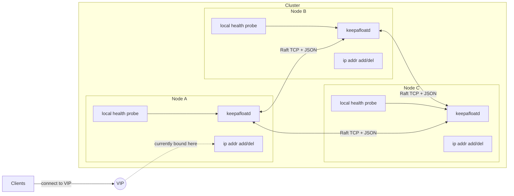
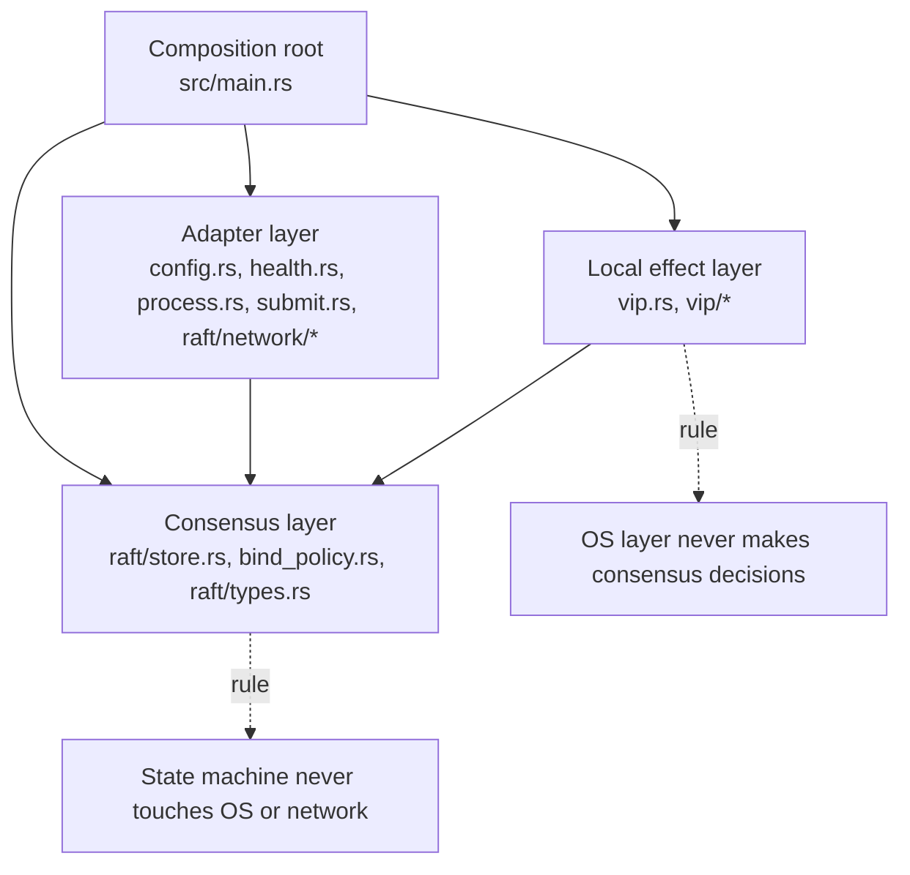
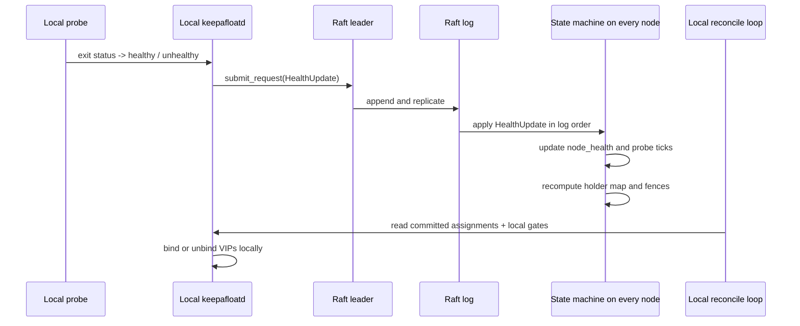
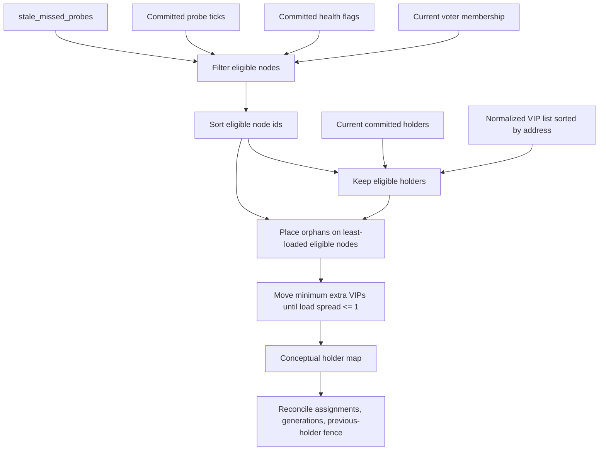
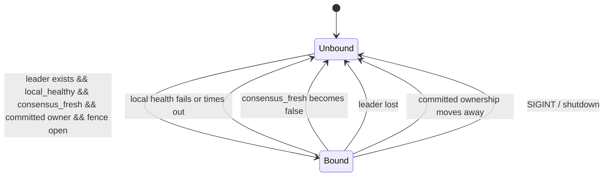
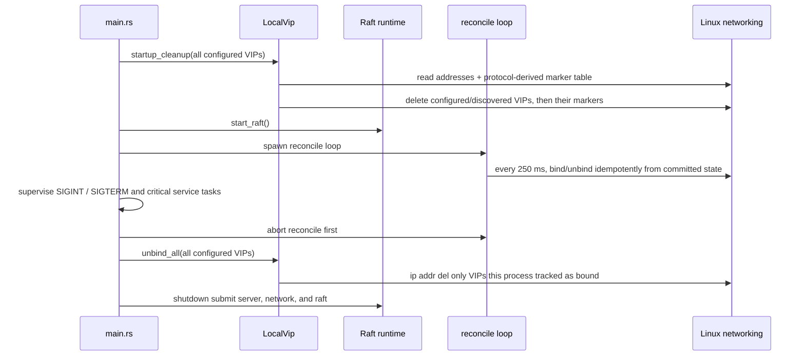
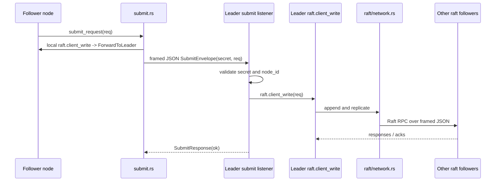
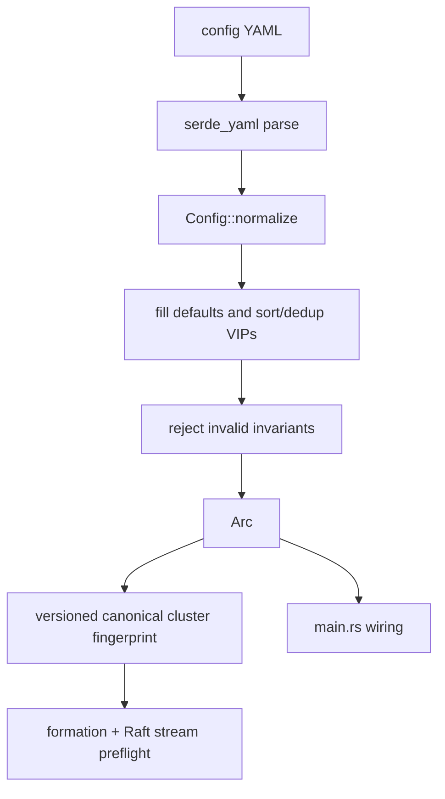
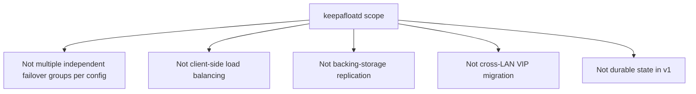

# keepAfloatD Architecture

This is the canonical architecture reference for `keepafloatd`; keep `AGENTS.md` short and point deeper design questions here.

Current-code note: some older design notes mention `HealthUpdate { node_id, healthy, unix_secs }` as the only replicated command, but the implementation in this repository has moved on. The current Raft log carries `HealthUpdate { node_id, healthy }` and `VipReleased { node_id, vip, generation }`, and peer staleness is derived from committed probe ticks rather than wall-clock timestamps.

## 1. System overview

`keepafloatd` is a small cluster-local control plane that elects which node should bind each VIP and then applies that decision through Linux networking commands on exactly one eligible owner at a time.

Each node runs one daemon process with one YAML config, one Raft identity, one health-check
definition, and one shared VIP set. The cluster may manage one VIP or multiple VIPs, but all of them
belong to the same failover group. Cold-start placement is round-robin across healthy voters;
subsequent changes minimize movement while keeping the spread even. Clients never talk to Raft
directly; they only see the VIP that is currently attached to one node's interface.

## 2. Layered architecture

The code is split into four layers so that consensus decisions stay deterministic while OS effects stay local and reversible.

- Consensus layer:
  - `src/raft/store.rs` owns replicated state, deterministic eligibility, and fenced VIP assignment recomputation.
  - `src/bind_policy.rs` mirrors the pure "should this node bind?" decision from committed state plus local gates.
- Local effect layer:
  - `src/vip.rs` coordinates local lifecycle; `src/vip/effects.rs` owns bounded `ip` command
    construction and verification; `src/vip/ownership.rs` owns Linux address-protocol discovery;
    `src/vip/notify.rs` owns bounded notify hooks; and `src/vip/reconcile.rs` maps committed
    ownership into those local effects and publishes confirmed release acknowledgments.
  - It tracks which VIPs this process has actually bound so cleanup is safe.
- Adapter layer:
  - `src/config.rs` loads and normalizes YAML; `src/config/fingerprint.rs` derives the canonical
    non-secret cluster identity.
  - `src/health.rs` runs the subprocess health check.
  - `src/process.rs` owns bounded Linux process groups for all daemon-owned child commands.
  - `src/submit.rs` forwards follower-originated writes to the leader.
  - `src/raft/tasks.rs` catches, reports, aborts, and joins Raft background control tasks.
  - `src/raft/network.rs` owns peer connection lifecycle, outbound preflight, and RPC exchange.
  - `src/raft/network/client.rs` adapts RPC exchange to OpenRaft's outbound client traits.
  - `src/raft/network/server.rs` owns listener admission, authentication, and stream supervision.
  - `src/raft/network/inbound.rs` owns authenticated, preflight-gated inbound RPC dispatch.
  - `src/raft/network/wire.rs` owns bounded framing, authentication handshakes, and compatibility
    checks.
  - `src/raft/network/status.rs` owns legacy-compatible capability and cluster-status probes.
- Composition root:
  - `src/main.rs` wires config, Raft, health publishing, submit listener, reconcile loop, and shutdown ordering.

The most important boundary is non-negotiable: the state machine never reads the network or the OS, and the OS layer never decides ownership on its own. If a proposed feature blurs that line, it is usually the wrong feature for this project.

## 3. Replicated state model

The Raft log carries small deterministic facts, while the state machine derives VIP ownership and handoff fences from those facts in exactly the same order on every node.

What the current code replicates through Raft:

- Direct keepafloatd requests:
  - `HealthUpdate { node_id, healthy }`
  - `VipReleased { node_id, vip, generation }`
  - `ClusterFormed { cluster_id, failover_semantics, config_identity_enforced }`
  - `EnableFailoverSemanticsV2`
  - `EnableConfigIdentityV1`
- OpenRaft membership entries:
  - membership changes are still OpenRaft log entries even though keepafloatd v1 does not expose a dynamic membership API

What lives in the replicated state machine or snapshot:

- `node_health: HashMap<NodeId, bool>`
- `node_probe_ticks: HashMap<NodeId, u64>`
- `latest_probe_tick: u64`
- `vip_assignments: HashMap<VipAddr, VipAssignment>`
- `vip_generation: HashMap<VipAddr, u64>`
- `cluster_epoch: Option<u128>`
- `failover_semantics: Legacy | V2`
- `config_identity_enforced: bool`
- recovery/nopreempt tracking used by the selected semantics
- `last_membership`

What is derived locally but not replicated:

- `local_healthy`: the latest result from this process's own probe task
- `consensus_fresh`: whether this node can still submit health or release updates through Raft
- `has_leader`: observed from local Raft metrics
- `LocalVip.bound`: the set of VIPs this process itself attached

Determinism rules in the current implementation:

- No wall-clock timestamps enter the replicated decision path.
- No RNG enters the state machine.
- Eligibility uses committed probe ticks, not local clocks.
- Nodes are sorted by id before placement and tie-breaking.
- VIPs are sorted by address during config normalization and then reused in that order.
- Lookup maps may be `HashMap`, but the inputs that drive recomputation are explicitly ordered before assignment.

`VipReleased` exists because ownership changes are fenced: a new holder may need to wait for the
old holder to confirm it has already unbound the VIP, or to wait until the old holder's committed
probes become stale. A fresh `healthy: false` report proves the old process is still participating
and therefore cannot substitute for its release acknowledgement. The old holder submits this
acknowledgement only after its kernel unbind succeeds or an exact-host query verifies that the
address is already absent.

## 4. VIP assignment algorithm

`recompute_vip_holder` turns membership plus committed health freshness into a deterministic,
minimal-movement owner map, then `reconcile_vip_assignments` adds handoff generations and
previous-holder fences.

Plain-language algorithm:

1. Start from the committed voter membership.
2. Keep only nodes whose committed `healthy` flag is `true`.
3. Drop any node whose committed probe tick lags the cluster's `latest_probe_tick` by more than `stale_missed_probes`.
4. Sort the surviving node ids ascending.
5. Keep every VIP whose current committed holder remains eligible.
6. Place orphaned VIPs, in address order, on the least-loaded eligible node (lowest id breaks ties).
7. If the load difference is greater than one, move only the needed donor VIPs; each donor's
   highest-address VIP moves, with node ties resolved deterministically by id. With no current
   holders, this reduces to round-robin.
8. Under V2 nopreempt, recovered nodes may receive orphans but are excluded as recipients of these
   proactive balancing moves.
9. If there are no eligible nodes, produce no owners at all.
10. Reconcile the raw owner map into `VipAssignment` values:
   - unchanged holder -> keep generation
   - changed holder -> bump generation, remember previous holder, and set a release/activation fence
   - assignment after an ownerless interval -> bump the retained generation and restore the
     activation holdoff; only a VIP with no generation history activates immediately
11. At the local effect boundary, the first bind must cross that fence. Once this process has safely
    bound the still-assigned VIP, a generation-scoped local activation proof prevents recovery of
    the recorded previous holder from revoking it. The proof is cleared on any unbind path and
    never carries into another generation; all leader, health, consensus-freshness, holder, and
    activation-tick gates still apply. If the previous holder releases after that first bind, the
    incumbent emits one more generation-scoped gratuitous ARP so removal of a crash orphan cannot
    leave neighbors using the old holder's MAC.

Worked example, 3 nodes and 3 VIPs (all three eligible before the first assignment; a staggered
start recomputes on every committed health report and converges on an equally balanced mapping
that depends on join order, derived identically on every replica):

- Healthy eligible nodes: `[1, 2, 3]`
- Sorted VIPs: `[10.0.0.101, 10.0.0.102, 10.0.0.103]`
- Result:
  - `10.0.0.101 -> 1`
  - `10.0.0.102 -> 2`
  - `10.0.0.103 -> 3`

After node `2` goes stale:

- Healthy eligible nodes: `[1, 3]`
- Same sorted VIPs
- Result:
  - `10.0.0.101 -> 1`
  - `10.0.0.102 -> 1`
  - `10.0.0.103 -> 3`

That redistribution happens on every node after it has applied the same committed prefix, so the cluster converges without any out-of-band coordinator.

## 5. Failover triggers

A VIP stays bound on this node only while local gates, committed ownership, and leadership visibility all remain true at the same time.

The three independent failover triggers are:

- Local health fails:
  - after continuous failure for `failover_delay_secs`, the health task flips `local_healthy` to
    `false` (default zero; a successful probe resets the delay)
  - the next 250 ms reconcile tick removes any VIP currently bound here
- This node stops being allowed to hold the VIP:
  - no current leader, or
  - committed ownership moves to another node, or
  - the replacement fence is not yet open
- A holder dies silently:
  - its committed probe tick stops advancing
  - once the lag exceeds `stale_missed_probes`, it becomes ineligible
  - recomputation reassigns the VIP everywhere
- A holder reports explicit failure but keeps publishing fresh probes:
  - recomputation may assign a replacement, but the replacement remains fenced
  - only the old holder's committed `VipReleased` opens the fence
  - a failed or unreadable kernel delete cannot be mistaken for a crash

There is also a local self-fencing path for partitions: if this node cannot commit health or release updates anymore, `consensus_fresh` flips false and the VIP is unbound even before the rest of the cluster necessarily marks it stale.

## 6. Crash and stop safety

Crash and stop safety are built into the lifecycle: reclaim on startup, idempotent reconcile in steady state, and explicit unbind-before-shutdown on stop.

Startup:

- Before `ip addr replace`, every bind writes a `throw` host route to dedicated policy table
  `10000 + address_protocol` with that protocol. The route is OS-held ownership evidence and
  survives process death. The protocol defaults to 246 and is node-local, not replicated or
  included in configuration identity. Operators must reserve the derived table from other routes
  and `ip rule` entries.
- An ambiguous marker-command result retains both graceful-cleanup tracking and first-bind state.
  A retry therefore still announces a newly attached address, while shutdown attempts exact
  address and marker deletion even if the original command reached the kernel before timing out.
- `LocalVip::startup_cleanup` obtains bounded JSON address and IPv4/IPv6 marker-route inventories.
  It matches this instance's exact route protocol to the sole interface carrying that IP, merges
  those addresses with the current configured VIPs, deletes the addresses, then deletes the marker
  routes before joining Raft. A marker left by interruption before address attachment is also
  removed. Current configured VIPs do not need a marker, preserving rolling-upgrade cleanup.
- Malformed or unreadable discovery data aborts startup. A marker must be an exact IPv4 `/32` or
  IPv6 `/128` `throw` route; an address found on multiple interfaces is ambiguous and fails closed.
- A failed delete is accepted only after an exact-host `ip addr show` proves absence. Spawn, probe,
  or still-present failures abort startup, so the node cannot acknowledge release while an orphan
  remains attached.
- The reconcile loop keeps all VIP effects and release acknowledgments disarmed until local
  `last_applied` reaches OpenRaft's leader-reported `cluster_committed` frontier. This prevents a
  wiped restart from binding while it has applied only an obsolete prefix of the replicated state.

Steady state:

- `run_reconcile_loop` ticks every 250 ms.
- Each tick is idempotent: the loop recomputes "should bind?" from:
  - `has_leader`
  - `local_healthy`
  - `consensus_fresh`
  - committed `VipAssignment`
  - previous-holder release / staleness fence
- A nonzero steady-state delete is successful only if an exact-host query proves the address is
  already absent. Query failure or a still-present address keeps the VIP tracked and the release
  fence closed.

Shutdown:

- `main.rs` aborts the reconcile loop first so cleanup does not race with a rebind.
- The submit listener is a critical task. Bind failure, unexpected completion, or task failure
  stops the composition root; shutdown joins the service tasks and returns lifecycle errors.
- Accepted submit clients, the Raft accept/reconnect/inbound task tree, and Raft's formation, epoch,
  activation, and stale-survivor control loops are owned and supervised. Unexpected completion,
  error, or panic stops the daemon; cancellation aborts and joins the children before listener and
  runtime shutdown.
- `unbind_all` runs before submit/network/Raft shutdown.
- `unbind_all` bounds each delete to 250 ms, retries it at most three times, attempts every tracked
  VIP, and returns an error if any cleanup remains exhausted. The sample systemd unit's
  `KillMode=mixed` keeps its graceful SIGTERM away from teardown-time children while retaining a
  cgroup-wide SIGKILL at `TimeoutStopSec`.
- Health probes, notify hooks, `ip`, and `arping` share one bounded Linux process-group runner. The
  guard sends SIGKILL to the group on normal completion, timeout, or future cancellation, and the
  direct child is reaped within a fixed bound. This prevents shell descendants and inherited output
  pipes from escaping shutdown.
- `LocalVip.bound` ensures this process only deletes VIPs it believes it attached itself.

This design makes crash recovery symmetrical: if the process dies without a graceful stop, the
next process start reclaims both configured VIPs and its marked crash orphans before participating
again. `address_protocol` is a network-namespace contract: operators must assign distinct values
to co-located keepafloatd instances, reserve each `10000 + value` table, and keep the value stable
across restarts. Rotate only after a graceful stop proves the old marker is absent; after a crash,
restart once with the old value or clean its addresses manually. The diskless daemon cannot infer
which other marker was formerly its own without risking another instance's addresses. During an
upgrade from an unmarked release, restart every node while soon-to-be-removed
VIPs remain configured, verify the live addresses have routes in the expected derived table, and
only then remove those VIPs.
Addresses already orphaned and removed before that transition cannot be attributed safely and
require manual cleanup.

## 7. Transport and auth

keepAfloatD uses two small TCP+JSON protocols: one for Raft peer RPC and one for follower-to-leader submit forwarding. Both require authentication with the cluster's shared secret.

`src/connection_admission.rs` supplies the shared two-stage semaphore gate used by both listeners:
one permit bounds work before authentication and a separate permit bounds accepted work afterward.

Raft peer transport (`src/raft/network.rs` and `src/raft/network/*`):

- module boundaries:
  - `network.rs`: peer links, reconnects, outbound preflight, and RPC exchange
  - `network/client.rs`: OpenRaft outbound client traits and whole-snapshot envelopes
  - `network/server.rs`: listener admission, authentication, and inbound task supervision
  - `network/inbound.rs`: authenticated inbound dispatch and preflight enforcement
  - `network/wire.rs`: bounded frames, secrets, incarnation flags, config preflight, and V2
    compatibility checks
  - `network/status.rs`: authenticated status responses and short-lived capability probes

- handshake:
  - 8-byte BE `node_id`
  - 4-byte BE secret length
  - secret bytes
  - 1-byte semantics/incarnation flag: `0` legacy/no incarnation, `1` legacy/incarnation,
    `2` V2/no incarnation, `3` V2/incarnation
  - flags `1` and `3` are followed by the 16-byte BE cluster incarnation
- first framed exchange on a new outbound stream:
  - `ClusterStatusRequest` advertises the sender's optional versioned config fingerprint and
    cancellation-safe reader capability
  - `ClusterStatusResponse` advertises the receiver's fingerprint, capability, and replicated
    enforcement flag
  - a concrete mismatch closes the stream before any Raft frame is dispatched
  - the connect + handshake + preflight operation has a five-second outer bound
  - before identity activation, a reconnect to a peer already authenticated and preflighted as
    legacy may repeat only the authenticated handshake; this avoids making quorum recovery depend
    on a legacy Raft actor answering a status RPC during an election
  - identity activation drops those legacy streams, and every following reconnect must complete
    the fingerprint preflight
- framed RPC payloads:
  - 4-byte BE frame length
  - JSON body
- concurrency model:
  - each outbound peer link is `Mutex<Option<TcpStream>>`
  - a slow peer does not block every other peer
  - the listener admits at most 32 unauthenticated and 64 authenticated connection tasks
  - eight connections per configured peer bound both phases together; peers sharing a canonical
    source IP share their combined quota, preserving capacity for other source addresses
  - authenticated inbound frame bodies share a 128 MiB pre-allocation byte budget
  - unknown source IPs are rejected before task admission; after the handshake, the claimed peer
    id must match the source IP advertised for that peer
  - outbound sockets bind to this node's advertised Raft IP so source checks remain valid on
    multi-homed hosts; peers sharing one IP rely on the cluster secret rather than IP identity
  - configuration rejects mixed IPv4/IPv6 endpoint families within either protocol roster because
    an advertised source address cannot be bound across address families
- failure handling:
  - any I/O or timeout failure drops only that peer stream
  - handshake reads and response writes have five-second deadlines
  - idle authenticated streams expire after the greater of five seconds and twice the heartbeat
    interval; once the first byte arrives, one five-second deadline covers the rest of the prefix
    and body, so trickled bytes never restart the budget
  - state acquisition, identity/semantics checks, and RPC dispatch share a five-second processing
    deadline; timeout drops the stream and returns its connection and frame-byte permits
  - cancellation while a request/response exchange is in flight also drops that stream; otherwise
    its unread response could be consumed by the next Raft RPC
  - inbound response writers require one nonblocking TCP write to accept the complete length prefix
    and payload; a short write closes the stream instead of resuming the body after an await
  - current readers advertise cancellation-safe stream ownership and may reuse a connection; this
    capability is negotiated independently from the older V2 failover-semantics handshake bit
  - legacy streams are reused only when state acquisition, dispatch, and the single nonblocking write complete inside
    80% of one heartbeat interval
  - a later legacy response is dropped before close, so the old reader's competing timeout cannot
    retain either a partial frame or a complete late response for the next RPC
  - background reconnect loops retry on short fixed intervals
  - RPC calls honor OpenRaft `hard_ttl` with a minimum timeout floor
  - diskless catch-up caps each unary AppendEntries payload at 32 log entries, preventing an
    expensive replay batch from repeatedly exceeding the heartbeat-derived RPC deadline

Follower-to-leader submit transport (`src/submit.rs`):

- framed JSON request/response over `client_submit_listen`
- fixed 4 KiB request/response frame cap, independent of the Raft snapshot cap
- at most 32 unauthenticated and 64 authenticated connection tasks; excess sockets and unknown
  source IPs are dropped before a request-sized allocation
- eight connections per configured peer across both phases; shared source IPs combine their quotas
- outbound forwarding binds to the local advertised submit IP; same-IP peers share the secret's
  trust boundary and cannot be distinguished by source address alone
- request reads and response writes have five-second deadlines
- `SubmitEnvelope` carries the required shared secret plus the inner request
- the leader revalidates both `cluster_secret` and `node_id` membership before calling `raft.client_write`
- the composition root supervises the listener, so an occupied socket or unexpected listener exit
  fails the daemon instead of silently removing the cluster write path

Authentication:

- Configuration without a non-empty `cluster_secret` is rejected before the listeners start.
- The public example placeholder is also rejected, preventing an unchanged sample from becoming a
  credential shared by unrelated installations.
- The inbound secret must match exactly on both Raft and submit connections.
- DEB and RPM packages install secret-bearing configs as root-owned mode `0600`, preserve locally
  edited config during upgrades, and reapply the restrictive mode in their post-install scripts.
- This improves safety on trusted segments, but it is not a replacement for mTLS or stronger network isolation.

Cluster formation (`src/raft/formation.rs`, `src/raft/probe.rs`):

- Formation requires no per-host configuration and no special node. On startup each node starts
  its transport, then runs auto-formation over a small `ClusterStatusRequest`/`ClusterStatusResponse`
  probe that rides the same handshake/framing (and `cluster_secret` auth) as Raft RPCs.
- Every node may form the cluster; two facts keep this safe under the in-memory store:
  - **Identical-config initialize.** Every node calls `Raft::initialize` with the *same*,
    cluster-wide identical membership (built from `peers`). OpenRaft documents concurrent
    `initialize` with the same config as safe (only *different* configs cause split brain; upgraded
    peers verify that premise with the config-identity preflight). Raft then elects a single leader among the
    reachable majority. Because no node is special, **any majority can form - or recover - the
    cluster even if the lowest-id node is permanently gone.** This matters for diskless/PXE nodes
    that keep no state across reboots: after a full outage, whichever majority comes back reforms
    the cluster on its own.
  - **Quorum gate + existing-cluster check.** A node initializes only after a majority of peers
    (including itself) respond *uninitialized*, so a network partition yields at most one side with
    a leader, never two. If any peer reports an existing cluster (`initialized` or a known leader),
    the node declines and joins as a follower via replication - so a blank-rebooted node **rejoins**
    rather than re-forming.
  - **Cluster incarnation fence.** The two facts above protect the common cases but leave one gap:
    if a minority is partitioned away and the majority then *loses its state and reforms* while the
    minority is still gone, the returning minority would hold stale, possibly higher-term state that
    Raft's log-recency rule could let win - overwriting the legitimate majority (the in-memory store
    violates Raft's durable-storage assumption). To close this, the first leader of a freshly formed
    cluster commits a random `ClusterFormed { cluster_id, failover_semantics,
    config_identity_enforced }` *incarnation*, which every member carries
    in the transport handshake. A node holding a *different* concrete incarnation has its Raft RPCs
    dropped at the dispatch layer (`epochs_compatible`), so a stale survivor can never drive a vote
    or append against a reformed majority. A blank node carries no incarnation and is always
    absorbed, so ordinary diskless rejoin is unchanged. For liveness, a leaderless node that probes
    a *majority* reporting one exact different incarnation on three consecutive one-second polls
    recognizes itself as the stale survivor and exits for a supervisor restart
    (`run_cluster_guard` over the pure `raft::guard::ClusterGuard`), returning blank to rejoin via
    replication. Distinct foreign incarnations are grouped separately and cannot form a false
    reset quorum. A node can only probe `roster - 1` peers while the quorum is `roster / 2 + 1`,
    so this self-reset cannot fire in a 1- or 2-node roster; such a survivor stays transport-fenced
    until an operator restarts it.
  - **Failover-semantics activation.** Old snapshots and rolling-upgrade clusters default to
    `Legacy`. An existing cluster commits `EnableFailoverSemanticsV2` only after every configured
    voter is reachable and advertises V2 support. A freshly formed majority may record V2 in
    `ClusterFormed` when every reachable voter supports it; an offline legacy voter is then fenced
    when it returns. Capability discovery uses a legacy-compatible status probe, so old peers can
    participate before activation. After activation, normal legacy Raft streams are rejected and
    reconnected with the V2 handshake. Existing Legacy recovery/nopreempt entries migrate
    conservatively because the old snapshot schema has no ownership evidence; V2 tracking becomes
    ownership-aware for failures committed after activation.
  - **Cluster-config identity.** `Config::cluster_config_fingerprint` hashes a manually encoded,
    versioned canonical form with SHA-256. It includes the sorted peer roster; sorted VIP
    address/prefix/effective-interface tuples; effective probe staleness and timing;
    behavior-relevant failover/failback policy; frame cap; and Raft timing. Equivalent direct VLAN
    sub-interface spelling, IPv4-mapped peer endpoints, and raw staleness values that produce the
    same whole missed-probe threshold are normalized, as is failback delay when nopreempt ignores it. It
    excludes the shared secret (compared directly) and every node-local setting. Formation counts
    only matching concrete fingerprints. An incompatible reachable peer is outside the candidate
    cluster and cannot downgrade the matching quorum's capabilities. New-to-new concrete
    mismatches are always rejected during the status preflight before Raft dispatch. An existing
    cluster commits `EnableConfigIdentityV1` only after all configured voters advertise the same
    identity; a fresh matching majority can set the flag in `ClusterFormed`. Before activation,
    missing fingerprints from older binaries remain compatible for rolling upgrade. After
    a successful legacy preflight, pre-activation reconnects may reuse that authenticated missing
    identity without another status round trip; this breaks a circular dependency between legacy
    status dispatch and Raft quorum recovery. After activation, missing identities are rejected and
    their existing streams are dropped. A node
    observing one exact foreign fingerprint on a majority for three rounds signals the composition
    root, which stops reconciliation, unbinds VIPs, shuts down Raft, and exits with status 4.
    The full peer set is scanned every round; a matching initialized minority cannot short-circuit
    or bypass that coherent-majority hold-down, and YAML peer order cannot change the decision.
    Distinct foreign fingerprints never add into a false majority. Status/preflight responses use
    a dedicated 64-KiB allocation cap independent of the larger Raft/snapshot frame cap.
- Diskless reality: with no durable log, a full-cluster reboot always reforms from scratch and
  re-converges within seconds (health and VIP ownership are ephemeral and continuously
  republished). This is the expected recovery path, not a failure mode. The only event that still
  requires a specific node is the *very first* formation, which needs any majority to be reachable.
  A node that kept state across a reform it was absent for is reconciled by the incarnation fence
  above rather than by a blank reboot.

## 8. Configuration model

The daemon takes one YAML file, normalizes it into a deterministic `Config`, and rejects invalid cluster-wide invariants before any runtime side effects begin.

Model:

- One file per process.
- Cluster-wide invariants that must match on every node:
  - `peers`
  - effective `vips` (including prefix and resolved VLAN sub-interface)
  - `health.interval_ms`
  - effective missed-probe staleness threshold derived from `health.stale_secs`
  - `failover_delay_secs`
  - `failback`
  - `failback_delay_secs` when `failback: true`
  - `cluster_secret`
  - `max_frame_bytes`
  - timing-sensitive tuning
- Per-host fields that legitimately differ:
  - `node_id`
  - `raft_listen`
  - `client_submit_listen`
  - `health.command`
  - `health.timeout_ms`
  - `submit_timeout_ms`
  - `dry_run`
  - `notify`
- Cluster formation is automatic - see "Cluster formation" above.

Defaults and normalization at load time:

- `health.stale_secs` defaults to a multiple of the probe interval if omitted.
- `failover_delay_secs` defaults to zero; `failback` defaults to true and
  `failback_delay_secs` defaults to 10 seconds.
- `max_frame_bytes` defaults to 4 MiB and is restricted to 64 KiB-16 MiB. Submit frames use a
  separate fixed 4 KiB cap.
- `submit_timeout_ms` defaults to 2000 ms and bounds both local leader writes and forwarded
  submit attempts.
- `raft` timing has defaults.
- VIPs are sorted by address and deduplicated.
- Equivalent direct and `vlan:` sub-interface spelling resolves to one effective VIP identity;
  IPv4-mapped IPv6 socket endpoints resolve to their IPv4 form; `stale_secs` values that produce
  the same whole missed-probe threshold share one identity; and
  `failback_delay_secs` is normalized away when `failback: false` ignores it.

Rejected at load time:

- empty peers, VIPs, or health command
- zero or obviously broken probe interval / timeout values
- `health.stale_secs < ceil(interval_ms / 1000)`
- duplicate peer ids
- duplicate or cross-role peer endpoints after IPv4-mapped IPv6 canonicalization
- `node_id` not present in `peers`
- missing, empty, overlong, or unchanged public-placeholder `cluster_secret`
- `max_frame_bytes < 64 KiB` or `max_frame_bytes > 16 MiB`
- non-positive `submit_timeout_ms`

Tolerated at runtime and turned into behavior instead of config failure:

- health command spawn failure or timeout -> node becomes unhealthy
- missing peer connectivity -> network errors, elections, or self-fencing
- missing `arping` success -> bind still succeeds; gratuitous ARP is best-effort
- stale leftover VIP from a previous process -> reclaimed during startup cleanup

Use `config.example.yaml` as the canonical example for real deployments and tests.

## 9. Multi-VIP scenarios

Multiple VIPs are intentionally active/active-ish across healthy voters, but the behavior still collapses safely when health or quorum changes.

Scenarios:

- Steady state:
  - cold-start VIPs are spread round-robin across healthy eligible voters
  - later changes keep healthy holders sticky and move only enough VIPs to stay even
  - This is not per-packet load balancing; each VIP still has exactly one owner at a time.
- One node fails or goes stale:
  - its VIPs migrate deterministically to the surviving eligible nodes
  - replacements wait for a release acknowledgement while the old holder's probes are fresh,
    including fresh explicit failure; stale holders use the extra committed-probe crash fallback
  - once a replacement process safely activates its still-assigned VIP, recovery cannot make that
    incumbent shed the VIP while the old holder catches up
- Two nodes fail in a 5-node cluster:
  - quorum still exists with 3 survivors
  - only orphaned or imbalance-required VIPs move onto those 3 survivors
- Quorum lost:
  - no leader means `should_bind_vip` returns false everywhere
  - all nodes unbind, which is the safe-by-default outcome

The important property is that multi-VIP support does not introduce separate failover groups; it only changes how one shared cluster distributes several addresses.

## 10. Non-goals

This architecture is intentionally narrow so the project stays a deterministic VIP selector rather than slowly turning into a general-purpose cluster manager.

Explicit non-goals:

- No multiple independent failover groups in one config.
  - If isolation is needed, run multiple daemon instances with separate configs and ports.
- No client-side load balancing.
  - Clients see one VIP owner at a time per address.
- No storage replication for the application behind the VIP.
  - `keepafloatd` chooses the front-end owner; it does not replicate NFS, databases, or application state.
- No cross-LAN VIP migration guarantee.
  - gratuitous ARP is fundamentally LAN-scoped
- No durable persistent state.
  - Raft log and snapshot data are kept in memory only; this is a deliberate fit for diskless/PXE
    nodes that retain nothing across reboots
  - cluster formation does not depend on durable state: any reachable majority reforms the cluster
    automatically (see "Cluster formation"), and a restart-safe reclaim path exists for VIPs
  - startup cleanup discovers only this instance's configured address protocol, also cleans all
    currently configured VIPs for upgrade compatibility, verifies kernel absence after a failed
    delete, and refuses to join Raft when an orphan remains or its absence cannot be proven

Features outside this list require an explicit project-scope decision before implementation.

### Process-local consensus proof expiry

The composition root and release publisher share a `ConsensusFreshness` watch. Each
successful health submit records its request-start instant; failures invalidate it immediately.
Release acknowledgements do not renew the health proof because they do not refresh the
node's replicated health tick.
Its lifetime is `interval_ms * effective_stale_missed_probes` plus half the replicated
activation-holdoff duration. This permits ordinary probe/RPC jitter at the minimum
valid stale window. Expiry rechecks the latest proof so a queued renewal cannot lose to
its previous timer deadline. The VIP adapter cancels
active reconciliation on invalidation/expiry, withdraws all tracked VIPs, retries failed
cleanup, and waits for a new proof before restarting binding reconciliation. While fenced,
it still publishes proven release acknowledgements. On renewal, the adapter validates the
current VIP effect and every retained bound VIP against newly applied state. An unchanged assignment, binding policy and
mandatory gates allow the existing effect to finish, including effects longer than a probe
interval. A changed intent cancels active work and cleans only the affected addresses
before the rotating cursor advances. Unchanged VIPs stay bound without redundant notify
events. Selective cleanup remains inside the same proof lifetime guard: expiry,
invalidation or a closed mandatory gate still withdraws every tracked address, even if
a fresh proof immediately follows an invalidation. Revocations arriving during cleanup
are queued before reconciliation resumes. This also covers an already-bound tail VIP
whose revocation would otherwise wait behind another VIP's slow RPC. Each VIP reads current applied state when its work begins;
generation and takeover-delay memory survive renewals. This independent
expiry prevents an isolated leader's blocked health probe or release RPC from retaining
VIPs after survivors reassign them (#26). The elapsed-time check is entirely process-local;
the replicated state machine still uses only committed probe rounds and contains no clock.

The submit-only `HealthUpdateWithProof` wire discriminator cannot be parsed by an older
server as a replicated `KafRequest`. A capable server converts it to the existing
`HealthUpdate` and returns the committed log ID. The follower waits for local application
through that index within the health submit timeout before publishing its request-start
proof. A rejected or indexless response fences local eligibility before sending an ordinary
unhealthy fallback; it never retries an ordinary healthy report. Ordinary clients and
release requests remain compatible with newer servers, and replicated entries are unchanged.
While renewal validation waits for the state lock, the effect retains its previously accepted
proof deadline. Only successful validation extends that deadline to the specific new proof.
A process-local invalidation epoch prevents a rapid invalidation followed by success from
concealing the required cleanup in a coalesced watch notification.

`vip::takeover::TakeoverDelay` independently waits a full proof lifetime plus cleanup allowance before local
activation of an unacknowledged stale takeover (#26). Committed rounds do not provide a
minimum wall-clock duration: slow probes and queued writes can advance them in a burst.
The wait is keyed by VIP, assignment generation and the previous holder's observed health
tick. It resets on any tick change, including a renewal that became stale between samples,
and is discarded on assignment loss. A matching release acknowledgement, an already
activated generation, or a first-ever assignment needs no additional wait. Assignments
restored after an ownerless interval still wait, because an absent previous-holder field
does not prove that an old kernel released the address. This state is process-local and
volatile; restart conservatively starts a new wait after startup cleanup.
The allowance is one reconciliation tick plus two existing bounded `ip` command budgets
per configured VIP (address and ownership marker removal). Safety assumes scheduling and
kernel effects complete within these practical bounds; failed cleanup is retried and logged.

The private-namespace regression is runnable as root with
`KEEP_AFLOATD_BIN=/absolute/path/keepafloatd tests/e2e/scripts/isolated-health-proof.sh`.
It runs three actual daemons with dry-run VIP effects, blocks the current leader's health
probe, isolates its transport, checks exclusive takeover, then verifies recovery of the
original processes. The namespace and its firewall rules are removed on exit.
