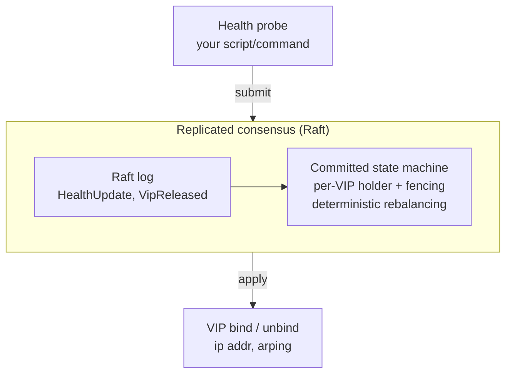

# keepAfloatD

**Highly available virtual IPs for Linux — multi-active, quorum-backed, no split brain.**

[](https://github.com/croit/keepAfloatD/actions/workflows/ci.yml)
[](LICENSE)

keepAfloatD keeps your service reachable through a floating virtual IP (VIP) even when a node
fails. Unlike classic active/passive failover, it distributes multiple VIPs across all healthy
nodes at once and uses Raft consensus to decide ownership — so a VIP is never held by two nodes,
and any majority of the cluster can keep serving or recover on its own.

## Features

- **Multi-active** — many VIPs spread evenly across every healthy node, not one hot node and cold standbys.
- **No split brain by design** — ownership is a committed Raft decision; without a quorum a node refuses to hold a VIP.
- **Health-checked failover & failback** — you supply a script/command; VIPs move off unhealthy nodes and (optionally) fail back when they recover.
- **Self-forming cluster** — nodes discover each other and elect a leader automatically; any majority can form or recover the cluster, in any start order.
- **Runs anywhere** — a single static binary, plus `.deb`, `.rpm` and multi-arch (amd64/arm64) container images.
- **IPv4 & IPv6**, optional 802.1Q VLAN tags, gratuitous ARP on takeover.
- **One small YAML config** per node; ships with a `systemd` unit.

## Quick start

**1. Install.** Grab a binary, package or image from the [latest release](https://github.com/croit/keepAfloatD/releases/latest):

```bash
# Debian/Ubuntu
sudo dpkg -i keepafloatd_*_amd64.deb

# RHEL/el9
sudo rpm -i keepafloatd-*.x86_64.rpm

# or the static binary
curl -fsSL -o keepafloatd https://github.com/croit/keepAfloatD/releases/latest/download/keepafloatd-linux-amd64
chmod +x keepafloatd && sudo mv keepafloatd /usr/local/bin/

# or a container
docker pull ghcr.io/croit/keepafloatd:latest
```

**2. Configure** each node — same cluster, one shared secret, one VIP list. Minimal `config.yaml`:

```yaml
node_id: 1
raft_listen: "10.0.0.1:7000"
client_submit_listen: "10.0.0.1:7001"
cluster_secret: "change-me-to-a-long-random-token"   # required; shared by every node
peers:
  - { id: 1, raft_address: "10.0.0.1:7000", client_submit_address: "10.0.0.1:7001" }
  - { id: 2, raft_address: "10.0.0.2:7000", client_submit_address: "10.0.0.2:7001" }
  - { id: 3, raft_address: "10.0.0.3:7000", client_submit_address: "10.0.0.3:7001" }
vips:
  - { address: "10.0.0.100", interface: "eth0" }
health:
  command: ["/bin/sh", "-c", "curl -sf http://127.0.0.1:8080/health >/dev/null"]
  interval_ms: 2000
  timeout_ms: 3000
```

Node 2 and 3 use the same file with their own `node_id` and listen addresses. See
[`config.example.yaml`](config.example.yaml) for every option.

**3. Run** (needs `CAP_NET_ADMIN` for `ip addr`, typically root):

```bash
sudo systemctl enable --now keepafloatd@node1     # packaged
# or
sudo keepafloatd -c /etc/keepafloatd/config.yaml  # foreground
```

The cluster forms itself, elects a leader, and binds the VIPs on healthy nodes. Kill a node and
its VIPs move to a survivor within seconds.

Want to try it without touching real addresses? The [`examples/`](examples/) configs use
`dry_run: true` and `interface: lo`, so three local processes exercise the full Raft + failover
flow safely.

## How it works

Each node runs a health probe and participates in a Raft cluster. Raft replicates health and
VIP-release acknowledgements; the committed state machine decides which node owns each VIP and
fences every handoff with a per-VIP generation, so at most one node ever binds an address.



For the full model — eligibility rules, fencing, failover paths and crash/restart symmetry — see
[the architecture guide](docs/architecture.md).

## keepAfloatD vs keepalived

Both give you floating VIPs with script-based health checks. keepalived elects ownership with
**VRRP** (active/passive per VIP); keepAfloatD elects it with **Raft consensus**, which lets it run
**multiple VIPs active across many nodes at once** and gives quorum-based protection against split
brain. If you want simple two-node VRRP, keepalived is great; if you want multi-active VIPs with
consensus, that is what keepAfloatD is for.

## Documentation

- **[Operations guide](docs/operations.md)** — running, observing, upgrading, securing and
  troubleshooting a cluster. For operators / system administrators.
- **[Development guide](docs/development.md)** — building, testing, the end-to-end scenario harness
  and code layout. For contributors.
- **[Architecture guide](docs/architecture.md)** — the consensus model, VIP fencing and failover design.

## Building from source

Requires a Rust 2024 toolchain (1.87+):

```bash
cargo build --release   # target/release/keepafloatd
cargo test
```

## Contributing & license

keepAfloatD is dual-licensed: **GNU AGPL v3** for open-source/community use, and a **commercial
license** available from [croit.io](https://croit.io). External contributions require a signed CLA
or copyright assignment — see [CONTRIBUTING.md](CONTRIBUTING.md), [LICENSE](LICENSE) and
[`LICENSES/`](LICENSES/).
