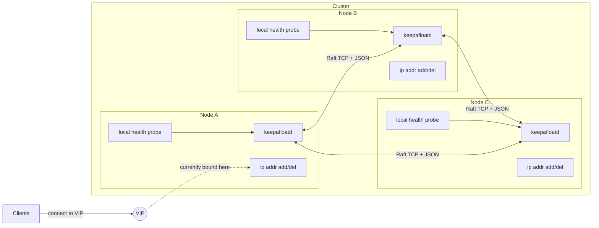
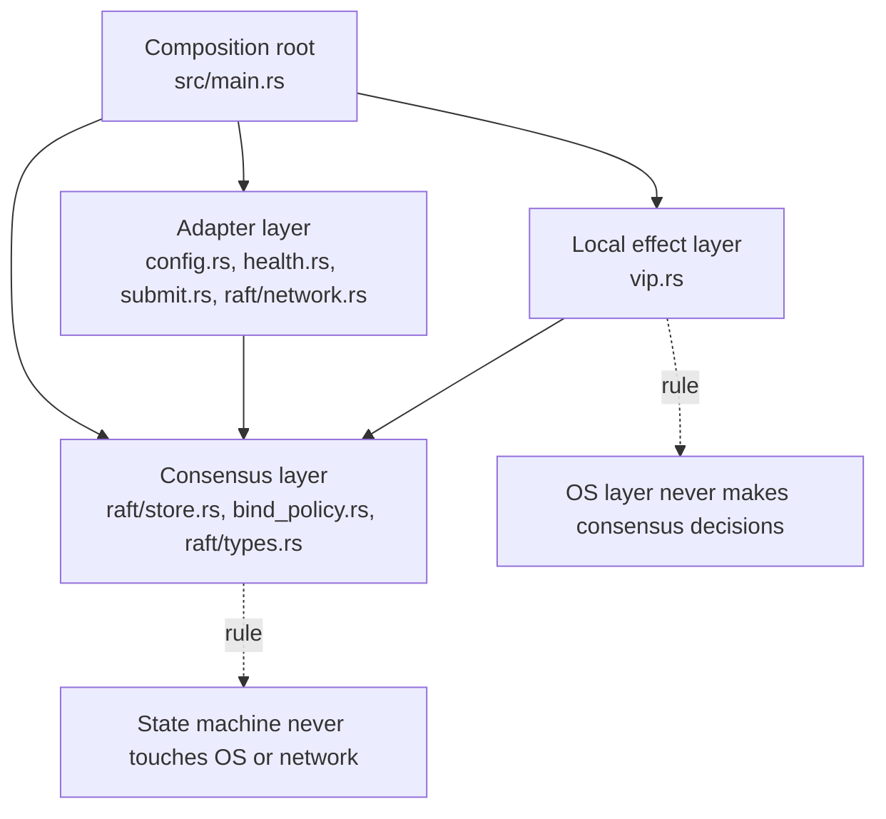
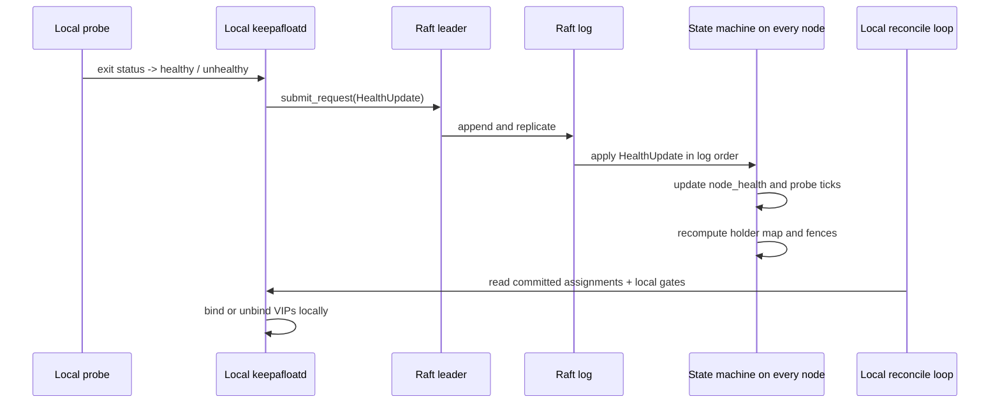
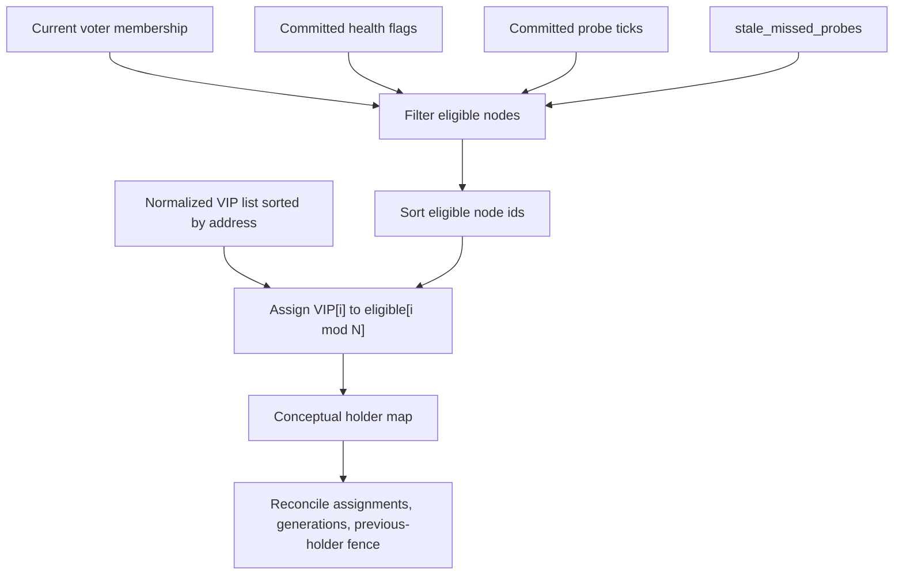
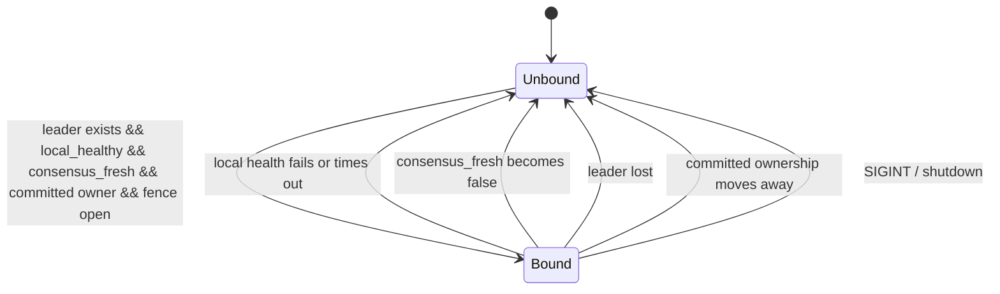
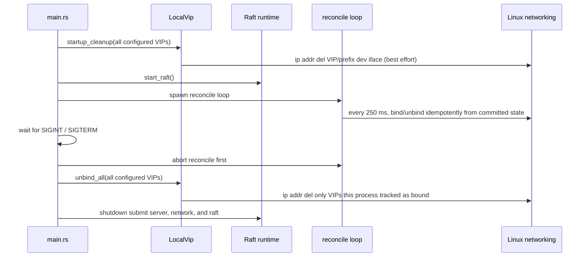
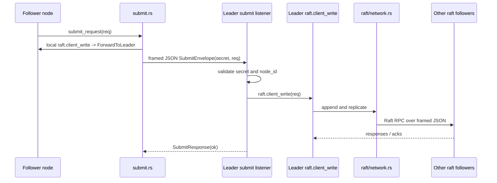
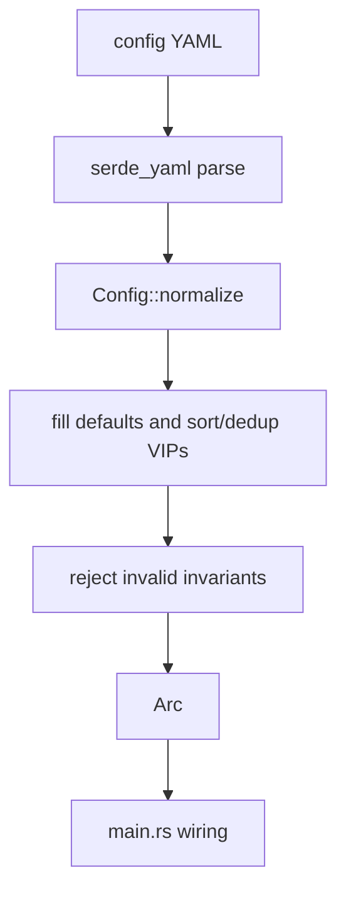
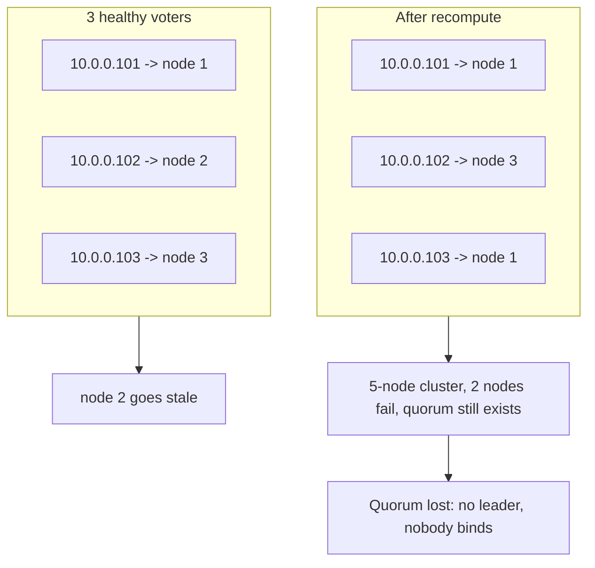
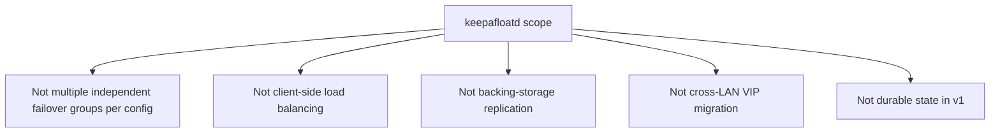

# keepAfloatD Architecture

This is the canonical architecture reference for `keepafloatd`; keep `AGENTS.md` short and point deeper design questions here.

Current-code note: some older design notes mention `HealthUpdate { node_id, healthy, unix_secs }` as the only replicated command, but the implementation in this repository has moved on. The current Raft log carries `HealthUpdate { node_id, healthy }` and `VipReleased { node_id, vip, generation }`, and peer staleness is derived from committed probe ticks rather than wall-clock timestamps.

## 1. System overview

`keepafloatd` is a small cluster-local control plane that elects which node should bind each VIP and then applies that decision through Linux networking commands on exactly one eligible owner at a time.

Each node runs one daemon process with one YAML config, one Raft identity, one health-check definition, and one shared VIP set. The cluster may manage one VIP or multiple VIPs, but all of them belong to the same failover group and are distributed round-robin across healthy voters. Clients never talk to Raft directly; they only see the VIP that is currently attached to one node's interface.

## 2. Layered architecture

The code is split into four layers so that consensus decisions stay deterministic while OS effects stay local and reversible.

- Consensus layer:
  - `src/raft/store.rs` owns replicated state, deterministic eligibility, and fenced VIP assignment recomputation.
  - `src/bind_policy.rs` mirrors the pure "should this node bind?" decision from committed state plus local gates.
- Local effect layer:
  - `src/vip.rs` is the only place that shells out to `ip` and `arping`.
  - It tracks which VIPs this process has actually bound so cleanup is safe.
- Adapter layer:
  - `src/config.rs` loads and normalizes YAML.
  - `src/health.rs` runs the subprocess health check.
  - `src/submit.rs` forwards follower-originated writes to the leader.
  - `src/raft/network.rs` provides the Raft peer transport.
- Composition root:
  - `src/main.rs` wires config, Raft, health publishing, submit listener, reconcile loop, and shutdown ordering.

The most important boundary is non-negotiable: the state machine never reads the network or the OS, and the OS layer never decides ownership on its own. If a proposed feature blurs that line, it is usually the wrong feature for this project.

## 3. Replicated state model

The Raft log carries small deterministic facts, while the state machine derives VIP ownership and handoff fences from those facts in exactly the same order on every node.

What the current code replicates through Raft:

- Direct keepafloatd requests:
  - `HealthUpdate { node_id, healthy }`
  - `VipReleased { node_id, vip, generation }`
- OpenRaft membership entries:
  - membership changes are still OpenRaft log entries even though keepafloatd v1 does not expose a dynamic membership API

What lives in the replicated state machine or snapshot:

- `node_health: HashMap<NodeId, bool>`
- `node_probe_ticks: HashMap<NodeId, u64>`
- `latest_probe_tick: u64`
- `vip_assignments: HashMap<VipAddr, VipAssignment>`
- `vip_generation: HashMap<VipAddr, u64>`
- `last_membership`

What is derived locally but not replicated:

- `local_healthy`: the latest result from this process's own probe task
- `consensus_fresh`: whether this node can still submit health or release updates through Raft
- `has_leader`: observed from local Raft metrics
- `LocalVip.bound`: the set of VIPs this process itself attached

Determinism rules in the current implementation:

- No wall-clock timestamps enter the replicated decision path.
- No RNG enters the state machine.
- Eligibility uses committed probe ticks, not local clocks.
- Nodes are sorted by id before round-robin assignment.
- VIPs are sorted by address during config normalization and then reused in that order.
- Lookup maps may be `HashMap`, but the inputs that drive recomputation are explicitly ordered before assignment.

`VipReleased` exists because ownership changes are fenced: a new holder may need to wait for the old holder to confirm it has already unbound the VIP, or to wait until the old holder has become ineligible.

## 4. VIP assignment algorithm

`recompute_vip_holder` turns membership plus committed health freshness into a deterministic round-robin owner map, then `reconcile_vip_assignments` adds handoff generations and previous-holder fences.

Plain-language algorithm:

1. Start from the committed voter membership.
2. Keep only nodes whose committed `healthy` flag is `true`.
3. Drop any node whose committed probe tick lags the cluster's `latest_probe_tick` by more than `stale_missed_probes`.
4. Sort the surviving node ids ascending.
5. Sort VIPs ascending by IP address. This already happened during config normalization, so every node sees the same order.
6. Assign VIP `i` to eligible node `i mod eligible.len()`.
7. If there are no eligible nodes, produce no owners at all.
8. Reconcile the raw owner map into `VipAssignment` values:
   - unchanged holder -> keep generation
   - changed holder -> bump generation, remember previous holder, and set a release/activation fence

Worked example, 3 nodes and 3 VIPs:

- Healthy eligible nodes: `[1, 2, 3]`
- Sorted VIPs: `[10.0.0.101, 10.0.0.102, 10.0.0.103]`
- Result:
  - `10.0.0.101 -> 1`
  - `10.0.0.102 -> 2`
  - `10.0.0.103 -> 3`

After node `2` goes stale:

- Healthy eligible nodes: `[1, 3]`
- Same sorted VIPs
- Result:
  - `10.0.0.101 -> 1`
  - `10.0.0.102 -> 3`
  - `10.0.0.103 -> 1`

That redistribution happens on every node after it has applied the same committed prefix, so the cluster converges without any out-of-band coordinator.

## 5. Failover triggers

A VIP stays bound on this node only while local gates, committed ownership, and leadership visibility all remain true at the same time.

The three independent failover triggers are:

- Local health fails:
  - the health task flips `local_healthy` to `false`
  - the next 250 ms reconcile tick removes any VIP currently bound here
- This node stops being allowed to hold the VIP:
  - no current leader, or
  - committed ownership moves to another node, or
  - the replacement fence is not yet open
- A holder dies silently:
  - its committed probe tick stops advancing
  - once the lag exceeds `stale_missed_probes`, it becomes ineligible
  - recomputation reassigns the VIP everywhere

There is also a local self-fencing path for partitions: if this node cannot commit health or release updates anymore, `consensus_fresh` flips false and the VIP is unbound even before the rest of the cluster necessarily marks it stale.

## 6. Crash and stop safety

Crash and stop safety are built into the lifecycle: reclaim on startup, idempotent reconcile in steady state, and explicit unbind-before-shutdown on stop.

Startup:

- `LocalVip::startup_cleanup` removes every configured VIP from its interface before the node rejoins Raft.
- This is best-effort by design: missing VIPs are logged as okay, and spawn failures are warnings.

Steady state:

- `run_reconcile_loop` ticks every 250 ms.
- Each tick is idempotent: the loop recomputes "should bind?" from:
  - `has_leader`
  - `local_healthy`
  - `consensus_fresh`
  - committed `VipAssignment`
  - previous-holder release / staleness fence

Shutdown:

- `main.rs` aborts the reconcile loop first so cleanup does not race with a rebind.
- `unbind_all` runs before submit/network/Raft shutdown.
- `LocalVip.bound` ensures this process only deletes VIPs it believes it attached itself.

This design makes crash recovery symmetrical: if the process dies without a graceful stop, the next process start still reclaims any leftover configured VIPs before participating again.

## 7. Transport and auth

keepAfloatD uses two small TCP+JSON protocols: one for Raft peer RPC and one for follower-to-leader submit forwarding, both optionally authenticated by a shared cluster secret.

Raft peer transport (`src/raft/network.rs`):

- handshake:
  - 8-byte BE `node_id`
  - 4-byte BE secret length
  - secret bytes
- framed RPC payloads:
  - 4-byte BE frame length
  - JSON body
- concurrency model:
  - each outbound peer link is `Mutex<Option<TcpStream>>`
  - a slow peer does not block every other peer
- failure handling:
  - any I/O or timeout failure drops only that peer stream
  - background reconnect loops retry on short fixed intervals
  - RPC calls honor OpenRaft `hard_ttl` with a minimum timeout floor

Follower-to-leader submit transport (`src/submit.rs`):

- framed JSON request/response over `client_submit_listen`
- `SubmitEnvelope` carries the optional shared secret plus the inner request
- the leader revalidates both `cluster_secret` and `node_id` membership before calling `raft.client_write`

Authentication:

- If `cluster_secret` is unset locally, missing secrets are accepted for backward-compatible trusted-network deployments.
- If `cluster_secret` is set locally, the inbound secret must match exactly.
- This improves safety on trusted segments, but it is not a replacement for mTLS or stronger network isolation.

Cluster formation (`auto_form_cluster` in `src/raft/mod.rs`, `src/raft/probe.rs`):

- Formation requires no per-host configuration and no special node. On startup each node starts
  its transport, then runs auto-formation over a small `ClusterStatusRequest`/`ClusterStatusResponse`
  probe that rides the same handshake/framing (and `cluster_secret` auth) as Raft RPCs.
- Every node may form the cluster; two facts keep this safe under the in-memory store:
  - **Identical-config initialize.** Every node calls `Raft::initialize` with the *same*,
    cluster-wide identical membership (built from `peers`). OpenRaft documents concurrent
    `initialize` with the same config as safe (only *different* configs cause split brain, and the
    shared `peers` roster already rules that out). Raft then elects a single leader among the
    reachable majority. Because no node is special, **any majority can form — or recover — the
    cluster even if the lowest-id node is permanently gone.** This matters for diskless/PXE nodes
    that keep no state across reboots: after a full outage, whichever majority comes back reforms
    the cluster on its own.
  - **Quorum gate + existing-cluster check.** A node initializes only after a majority of peers
    (including itself) respond *uninitialized*, so a network partition yields at most one side with
    a leader, never two. If any peer reports an existing cluster (`initialized` or a known leader),
    the node declines and joins as a follower via replication — so a blank-rebooted node **rejoins**
    rather than re-forming.
  - **Cluster incarnation fence.** The two facts above protect the common cases but leave one gap:
    if a minority is partitioned away and the majority then *loses its state and reforms* while the
    minority is still gone, the returning minority would hold stale, possibly higher-term state that
    Raft's log-recency rule could let win — overwriting the legitimate majority (the in-memory store
    violates Raft's durable-storage assumption). To close this, the first leader of a freshly formed
    cluster commits a random `ClusterFormed { cluster_id }` *incarnation*, which every member carries
    in the transport handshake. A node holding a *different* concrete incarnation has its Raft RPCs
    dropped at the dispatch layer (`epochs_compatible`), so a stale survivor can never drive a vote
    or append against a reformed majority. A blank node carries no incarnation and is always
    absorbed, so ordinary diskless rejoin is unchanged. For liveness, a leaderless node that probes
    a *majority* reporting a different incarnation recognizes itself as the stale survivor and exits
    for a supervisor restart (`run_cluster_guard`), returning blank to rejoin via replication.
- Diskless reality: with no durable log, a full-cluster reboot always reforms from scratch and
  re-converges within seconds (health and VIP ownership are ephemeral and continuously
  republished). This is the expected recovery path, not a failure mode. The only event that still
  requires a specific node is the *very first* formation, which needs any majority to be reachable.
  A node that kept state across a reform it was absent for is reconciled by the incarnation fence
  above rather than by a blank reboot.

## 8. Configuration model

The daemon takes one YAML file, normalizes it into a deterministic `Config`, and rejects invalid cluster-wide invariants before any runtime side effects begin.

Model:

- One file per process.
- Cluster-wide invariants that must match on every node:
  - `peers`
  - `vips`
  - `health.interval_ms`
  - `health.stale_secs`
  - `cluster_secret`
  - `max_frame_bytes`
  - timing-sensitive tuning
- Per-host fields that legitimately differ:
  - `node_id`
  - `raft_listen`
  - `client_submit_listen`
- Cluster formation is automatic — see "Cluster formation" above.

Defaults and normalization at load time:

- `health.stale_secs` defaults to a multiple of the probe interval if omitted.
- `max_frame_bytes` defaults to 4 MiB.
- `submit_timeout_ms` defaults to 2000 ms and bounds both local leader writes and forwarded
  submit attempts.
- `raft` timing has defaults.
- VIPs are sorted by address and deduplicated.

Rejected at load time:

- empty peers, VIPs, or health command
- zero or obviously broken probe interval / timeout values
- `health.stale_secs < ceil(interval_ms / 1000)`
- duplicate peer ids
- `node_id` not present in `peers`
- empty or overlong `cluster_secret`
- `max_frame_bytes < 64 KiB`
- non-positive `submit_timeout_ms`

Tolerated at runtime and turned into behavior instead of config failure:

- health command spawn failure or timeout -> node becomes unhealthy
- missing peer connectivity -> network errors, elections, or self-fencing
- missing `arping` success -> bind still succeeds; gratuitous ARP is best-effort
- stale leftover VIP from a previous process -> reclaimed during startup cleanup

Use `config.example.yaml` as the canonical example for real deployments and tests.

## 9. Multi-VIP scenarios

Multiple VIPs are intentionally active/active-ish across healthy voters, but the behavior still collapses safely when health or quorum changes.

Scenarios:

- Steady state:
  - VIPs are spread round-robin across healthy eligible voters.
  - This is not per-packet load balancing; each VIP still has exactly one owner at a time.
- One node fails or goes stale:
  - its VIPs migrate deterministically to the surviving eligible nodes
  - replacements may wait for a release ack or one extra committed probe tick, depending on the previous holder's eligibility
- Two nodes fail in a 5-node cluster:
  - quorum still exists with 3 survivors
  - VIPs collapse onto those 3 survivors via the same round-robin algorithm
- Quorum lost:
  - no leader means `should_bind_vip` returns false everywhere
  - all nodes unbind, which is the safe-by-default outcome

The important property is that multi-VIP support does not introduce separate failover groups; it only changes how one shared cluster distributes several addresses.

## 10. Non-goals

This architecture is intentionally narrow so the project stays a deterministic VIP selector rather than slowly turning into a general-purpose cluster manager.

Explicit non-goals:

- No multiple independent failover groups in one config.
  - If isolation is needed, run multiple daemon instances with separate configs and ports.
- No client-side load balancing.
  - Clients see one VIP owner at a time per address.
- No storage replication for the application behind the VIP.
  - `keepafloatd` chooses the front-end owner; it does not replicate NFS, databases, or application state.
- No cross-LAN VIP migration guarantee.
  - gratuitous ARP is fundamentally LAN-scoped
- No durable persistent state.
  - Raft log and snapshot data are kept in memory only; this is a deliberate fit for diskless/PXE
    nodes that retain nothing across reboots
  - cluster formation does not depend on durable state: any reachable majority reforms the cluster
    automatically (see "Cluster formation"), and a restart-safe reclaim path exists for VIPs

When an AI agent proposes features outside this list, the default answer should be to push back unless the project's stated scope has explicitly changed.
